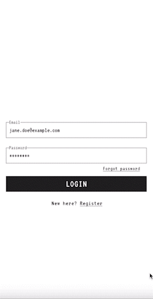

Beginner-friendly zero-to-hero series "Building a Social Network" shows step by step
how to design and build REST API and a Progressive Web Application for a "Pixelgram".
<!--more-->
I'm very excited about this project and hope it'll help someone learn full-stack development from drawing a sketch to deploying an enterprise-grade product to the cloud:-)

Here's a sneak peak to how it might look like in the end:

