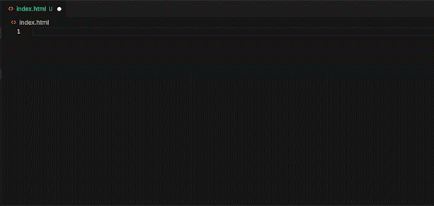
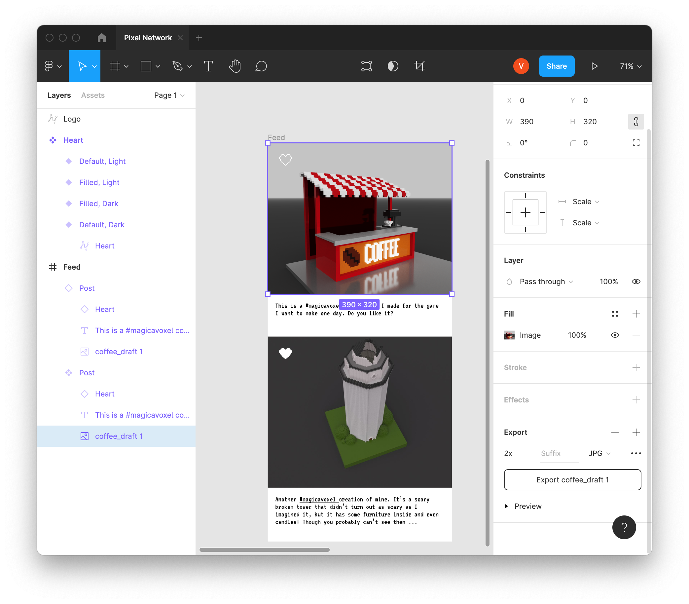
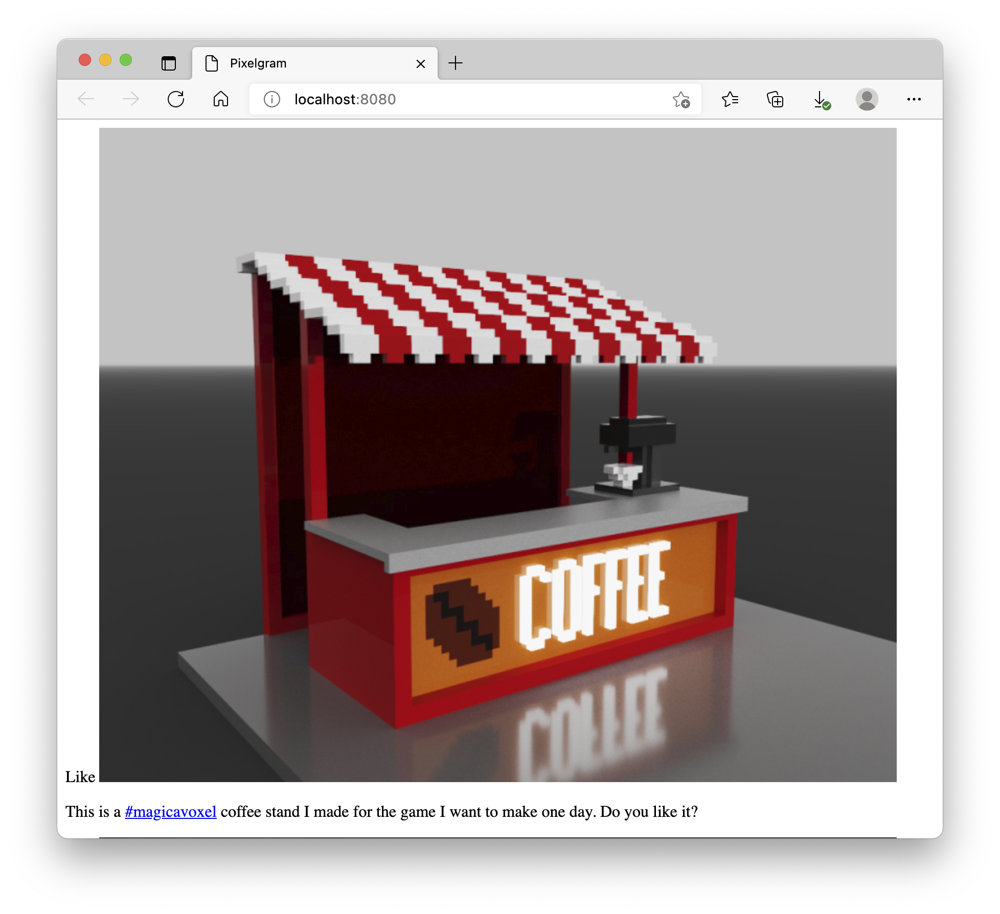
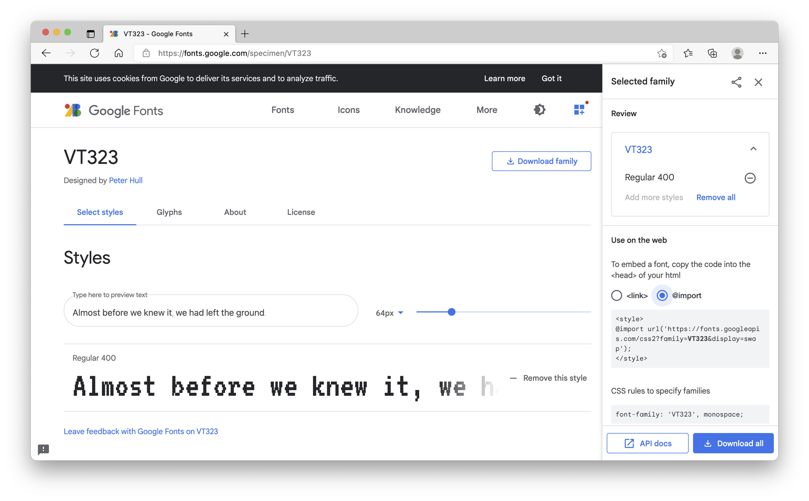
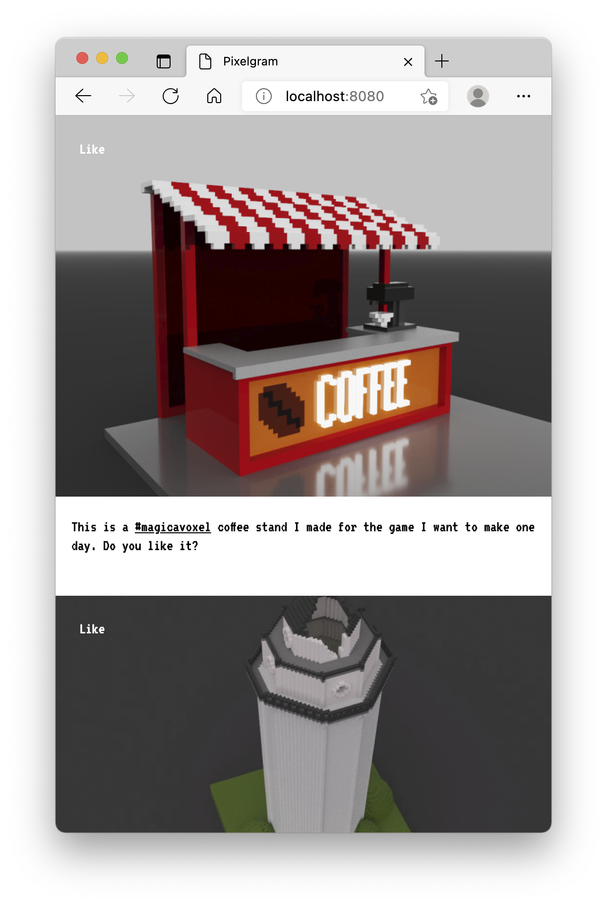
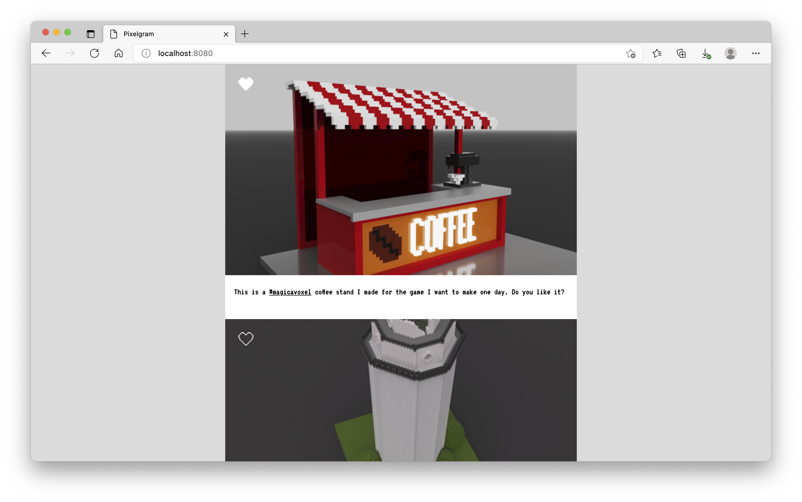
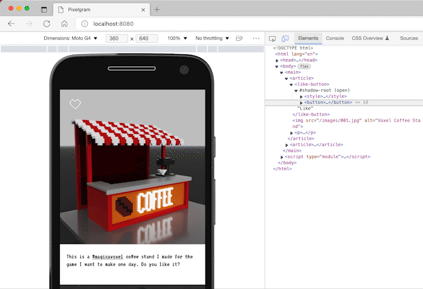
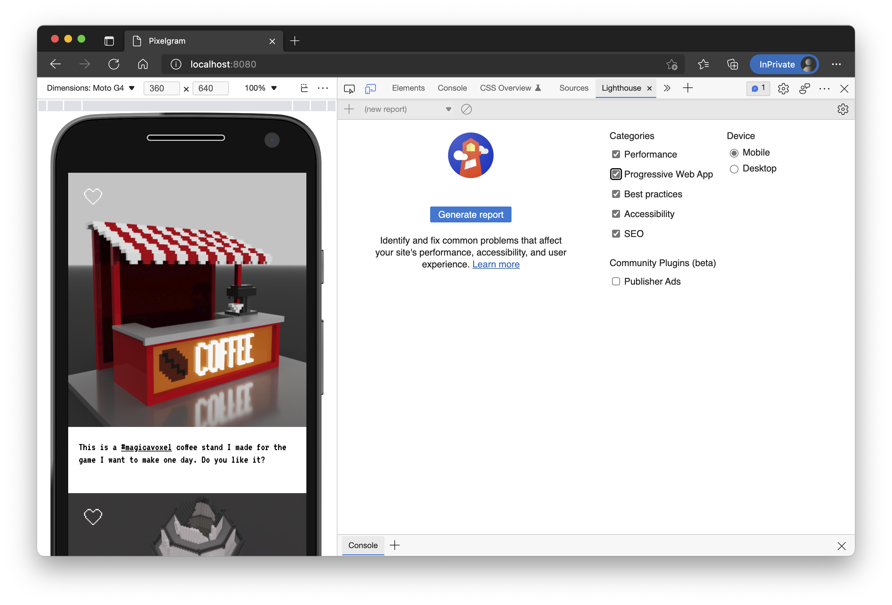
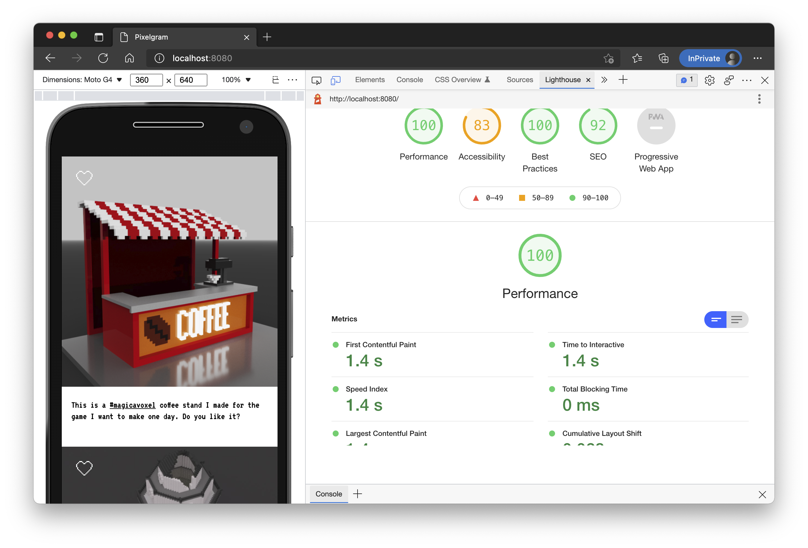
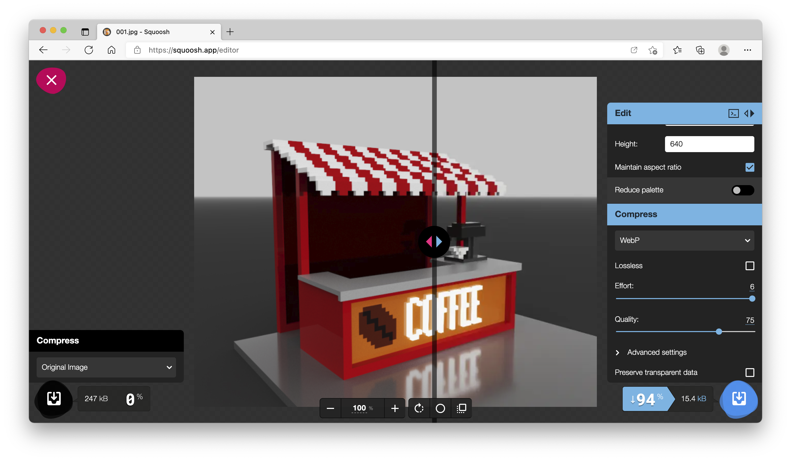

The design prototype is ready and we are about to bring the very first version of the project to life in a form of a *progressive web application* (PWA)🤩
<!--more-->
You've already had the pleasure to briefly meet HyperText Markup Language in the previous articles and you've probably figured that HTML is all about choosing the right *tag* for the job and nesting them one into the other. 

## HTML

Without further ado, create a new folder called `app` by the side of the `web-server`.

Create a a file `app/index.html`, open it with your editor, type `html:5` and press "Enter":


Cool, right? This is a feature of VSCode, called [emmet snippets](https://code.visualstudio.com/docs/editor/emmet), though I'm sure other editors have similar functionality. 
 
Here's what you should have in you `index.html` now:
```html
<!DOCTYPE html>
<html lang="en">
<head>
    <meta charset="UTF-8">
    <meta http-equiv="X-UA-Compatible" content="IE=edge">
    <meta name="viewport" content="width=device-width, initial-scale=1.0">
    <title>Document</title>
</head>
<body>
    
</body>
</html>
```

First couple of lines are inevitable *boilerplate*, dictated by [HTML Specification](https://html.spec.whatwg.org/multipage/). If you intend to have content in a language other than English, do change `<html lang="en">` attribute to the language code you are going to use.

In the *head* part we specify that content will be encoded in UTF-8: `<meta charset="UTF-8">`, which means we'll support non-Latin characters, emojis and a variety of symbols. 

We can delete `<meta http-equiv="X-UA-Compatible" content="IE=edge">`, its only valid for an old Internet Explorer version and ~~I'm not into necromancy~~ we are building a modern application that requires modern functionality.

Meta-tag `<meta name="viewport" content="width=device-width, initial-scale=1.0">` allows the page to be *responsive* to device width and sets the width of the content to fit device width, as opposed to setting page width to fit the content. 

Let's also change the title to something more appealing, I called my future network `Pixelgram` (don't judge, its a working title 🥴):
```html
<title>Pixelgram</title>
```

And, finally, let's fill the body with some actual markup. Here's the full version:
```html
<!DOCTYPE html>
<html lang="en">
  <head>
    <meta charset="UTF-8" />
    <meta name="viewport" content="width=device-width, initial-scale=1.0" />
    <title>Pixelgram</title>
  </head>
  <body>
    <main>
      <article>
        <like-button>Like</like-button>
        
        <p>
          This is a <a href="/magicavoxel">#magicavoxel</a> coffee stand I made
          for the game I want to make one day. Do you like it?
        </p>
      </article>
      <article>
        <like-button>Like</like-button>
        
        <p>
          Another <a href="/magicavoxel">#magicavoxel</a> creation of mine. It's
          a scary broken tower that didn't turn out as scary as I imagined it,
          but it has some furniture inside and even candles! Though you probably
          can't see them ...
        </p>
      </article>
    </main>
  </body>
</html>
```

You could open the file directly in your browser, but we do have a web server, so let's make it serve files instead of `I AM GROOT`. We don't need to re-invent the wheel here, *serving static content* is a very common procedure and therefore Go already has a solution for it.

Replace the whole `web-server/main.go` with this code:
```go
package main

import (
	"log"
	"net/http"
)

func main() {
	address := "localhost:8080"
	log.Printf("Server is listening on: http://%v", address)
	http.Handle("/", http.FileServer(http.Dir("../app")))
	err := http.ListenAndServe(address, nil)
	if err != nil {
		log.Fatal(err)
	}
}
```

Run web-server with `go run .` and enjoy your *file server* 😎.

You can remove all the tests from `main_test.go` too or remove the whole file altogether - there's not much for us to test anymore.

But if you'll check the page now, it'll appear a little bit broken:


To extract a picture from Figma select it and scroll properties down to "export":

 
I've saved images to the `app/images` folder and renamed them to `001.jpg` and `002.jpg`.

The page should now be looking a bit better:


That's a huge image, isn't it? 
And that's expected: I chose `2x` size when exporting, otherwise, it'd be too small for bigger screens & it wouldn't look good on retina displays.

Though it doesn't look anywhere close to what we've designed... yet

## Cascade Style Sheets

While HTML is, as the name dictates, a *markup* language, *CSS* is a way to add *style* to pages.

So let's start by changing the font. 
If you remember the font we used was [VT323](https://fonts.google.com/specimen/VT323) and Google fonts have an easy way of adding it to a webpage:


 
Select "@import" option and add the resulting snippet to the html document:
```html
  <head>
    <meta charset="UTF-8" />
    <meta name="viewport" content="width=device-width, initial-scale=1.0" />
    <title>Pixelgram</title>
    <style>
      @import url("https://fonts.googleapis.com/css2?family=VT323&display=swap");
      html {
        font-family: "VT323", monospace;
      }
    </style>
  </head>
```

You should now see that the text is now rendered with the font we've chosen.

We've set a `font-family` directive for the whole `html`, so unless it'll be overwritten by descendants, it'll effectively change any text font on the page to `VT323` or, if there isn't any other available *monospace* font.

And the `@import` declaration includes style from a remote server that in their turn reference `woff` font files and set metadata.

Let's add the rest of the styles:
```html
    <style>
      @import url("https://fonts.googleapis.com/css2?family=VT323&display=swap");
      html {
        font-family: "VT323", monospace;
        background: gainsboro;
      }
      html,
      body {
        padding: 0;
        margin: 0;
      }
      body {
        /* Uses default font-size for better accessibility */
        /*font-size: 16px;*/
        line-height: 1.2;
        display: flex;
        flex-direction: column;
      }
      img {
        max-width: 100%;
      }
      article {
        position: relative;
      }
      article img {
        width: 100%;
        height: 24rem;
        object-fit: cover;
      }
      article p {
        margin: 0.5rem 0;
        padding: 0.5rem 1rem;
      }
      article + article {
        margin-top: 2rem;
      }
      main {
        max-width: 40rem;
        margin: 0 auto;
        background: white;
      }
      a {
        color: inherit;
      }
      like-button {
        position: absolute;
        z-index: 2;
        top: 1.5rem;
        left: 1.5rem;
        background: transparent;
        border: 0;
        padding: 0;
        cursor: pointer;
        color: white;
      }
    </style>
```

And voilá:

 
I won't dive too deep into CSS syntax, there are great resources for that, e.g. [MDN](https://developer.mozilla.org/en-US/docs/Web/CSS) or [W3School](https://www.w3schools.com/Css/), but some things are worth mentioning.

In the comment about font size, I've used `px` as a unit, but later on, I only used `rem` - a unit *relative* to the document's font size. As I mentioned in the design article, I prefer to use numbers dividable by 8 and that's easy to do with `rem` equal `16px`. Besides, when a user changes the default font size for the browser - the spaces will grow accordingly, keeping the overall look. 

Almost there! What about that "Like" button?

## Custom WebComponents

There isn't a built-in `like-button` tag in HTML. But we can add it with a little bit of JavaScript!

Create a folder `app/scripts` and create `LikeButton.js` file there:
```js
export default class LikeButton extends HTMLElement {

    constructor() {
        super()
        this.attachShadow({ mode: 'open' })
        const style = document.createElement('style')
        style.textContent = `
        button {
            border:none; 
            background:transparent; 
            padding:0;
            cursor:pointer;
        }
        button[data-liked] #heart-filler{
            fill: white;
        }
        `
        const button = document.createElement('button')
        button.innerHTML = `<svg width="28" height="24" viewBox="0 0 28 24" fill="none" xmlns="http://www.w3.org/2000/svg">
        <path d="M12 22.2857H13.7143V24H12V22.2857ZM13.7143 22.2857H15.4286V24H13.7143V22.2857ZM10.2857 20.5714H12V22.2857H10.2857V20.5714ZM15.4286 20.5714H17.1429V22.2857H15.4286V20.5714ZM8.57143 18.8571H10.2857V20.5714H8.57143V18.8571ZM17.1429 18.8571H18.8571V20.5714H17.1429V18.8571ZM6.85714 17.1429H8.57143V18.8571H6.85714V17.1429ZM18.8571 17.1429H20.5714V18.8571H18.8571V17.1429ZM5.14286 15.4286H6.85714V17.1429H5.14286V15.4286ZM20.5714 15.4286H22.2857V17.1429H20.5714V15.4286ZM3.42857 13.7143H5.14286V15.4286H3.42857V13.7143ZM22.2857 13.7143H24V15.4286H22.2857V13.7143ZM1.71429 12H3.42857V13.7143H1.71429V12ZM24 12H25.7143V13.7143H24V12ZM0 8.57143H1.71429V10.2857H0V8.57143ZM25.7143 8.57143H27.4286V10.2857H25.7143V8.57143ZM0 6.85714H1.71429V8.57143H0V6.85714ZM25.7143 6.85714H27.4286V8.57143H25.7143V6.85714ZM0 5.14286H1.71429V6.85714H0V5.14286ZM25.7143 5.14286H27.4286V6.85714H25.7143V5.14286ZM1.71429 3.42857H3.42857V5.14286H1.71429V3.42857ZM24 3.42857H25.7143V5.14286H24V3.42857ZM12 3.42857H13.7143V5.14286H12V3.42857ZM13.7143 3.42857H15.4286V5.14286H13.7143V3.42857ZM8.57143 0H10.2857V1.71429H8.57143V0ZM17.1429 0H18.8571V1.71429H17.1429V0ZM10.2857 1.71429H12V3.42857H10.2857V1.71429ZM15.4286 1.71429H17.1429V3.42857H15.4286V1.71429ZM1.71429 10.2857H3.42857V12H1.71429V10.2857ZM24 10.2857H25.7143V12H24V10.2857ZM5.14286 0H6.85714V1.71429H5.14286V0ZM20.5714 0H22.2857V1.71429H20.5714V0ZM6.85714 0H8.57143V1.71429H6.85714V0ZM18.8571 0H20.5714V1.71429H18.8571V0ZM3.42857 1.71429H5.14286V3.42857H3.42857V1.71429ZM22.2857 1.71429H24V3.42857H22.2857" fill="white"/>
        <path id="heart-filler" d="M12 22.2857H13.7143H15.4286V20.5714H17.1429V18.8571H18.8571V17.1429H20.5714V15.4286H22.2857V13.7143H24V12V10.2857H25.7143V8.57143V6.85714V5.14286H24V3.42857V1.71429H22.2857H20.5714H18.8571H17.1429V3.42857H15.4286V5.14286H13.7143H12V3.42857H10.2857V1.71429H8.57143H6.85714H5.14286V3.42857H3.42857V5.14286H1.71429V6.85714V8.57143V10.2857H3.42857V12V13.7143H5.14286V15.4286H6.85714V17.1429H8.57143V18.8571H10.2857V20.5714H12V22.2857Z" fill="transparent"/>
        </svg>`
        button.onclick = this.toggleLike
        this.shadowRoot.append(style, button)
    }

    toggleLike = () => {
        this.isLiked = !this.isLiked
    }

    /**
     * @returns {boolean}
     */
    get isLiked() {
        return this.shadowRoot.lastElementChild.getAttribute('data-liked') != null
    }

    /**
     * @param {boolean} state
     */
    set isLiked(state) {
        state ? this.shadowRoot.lastElementChild.setAttribute('data-liked', "") : this.shadowRoot.lastElementChild.removeAttribute('data-liked')
    }

}
```

I'll walk you through it, as I always do, but first, let's see what it does. And to do so let's use this newly created *component* from inside of `index.html`:
```html
<script type="module">
import LikeButton from "/scripts/LikeButton.js"
customElements.define('like-button', LikeButton)
</script>
</body>
```

And ta-da! A beautiful pixel heart button that toggles its state on click:

 
So how does it work? We defined a class *extending* `HTMLElement`:
```js
class LikeButton extends HTMLElement {

    constructor() {
        super()
    }
}
```

Added so called *shadow DOM*: a nested in-memory HTML document:
```js
this.attachShadow({ mode: 'open' })
```

Added it's own scoped *style* to it:
```js
const style = document.createElement('style')
style.textContent = `
        button {
            border:none; 
            background:transparent; 
            padding:0;
            cursor:pointer;
        }
        button[data-liked] #heart-filler{
            fill: white;
        }`
```

A button with an *SVG* heart image:
```js
const button = document.createElement('button')
        button.innerHTML = `<svg width="28" height="24" viewBox="0 0 28 24" fill="none" xmlns="http://www.w3.org/2000/svg">
        <path d="M12 22.2857H13.7143V24H12V22.2857ZM13.7143 22.2857H15.4286V24H13.7143V22.2857ZM10.2857 20.5714H12V22.2857H10.2857V20.5714ZM15.4286 20.5714H17.1429V22.2857H15.4286V20.5714ZM8.57143 18.8571H10.2857V20.5714H8.57143V18.8571ZM17.1429 18.8571H18.8571V20.5714H17.1429V18.8571ZM6.85714 17.1429H8.57143V18.8571H6.85714V17.1429ZM18.8571 17.1429H20.5714V18.8571H18.8571V17.1429ZM5.14286 15.4286H6.85714V17.1429H5.14286V15.4286ZM20.5714 15.4286H22.2857V17.1429H20.5714V15.4286ZM3.42857 13.7143H5.14286V15.4286H3.42857V13.7143ZM22.2857 13.7143H24V15.4286H22.2857V13.7143ZM1.71429 12H3.42857V13.7143H1.71429V12ZM24 12H25.7143V13.7143H24V12ZM0 8.57143H1.71429V10.2857H0V8.57143ZM25.7143 8.57143H27.4286V10.2857H25.7143V8.57143ZM0 6.85714H1.71429V8.57143H0V6.85714ZM25.7143 6.85714H27.4286V8.57143H25.7143V6.85714ZM0 5.14286H1.71429V6.85714H0V5.14286ZM25.7143 5.14286H27.4286V6.85714H25.7143V5.14286ZM1.71429 3.42857H3.42857V5.14286H1.71429V3.42857ZM24 3.42857H25.7143V5.14286H24V3.42857ZM12 3.42857H13.7143V5.14286H12V3.42857ZM13.7143 3.42857H15.4286V5.14286H13.7143V3.42857ZM8.57143 0H10.2857V1.71429H8.57143V0ZM17.1429 0H18.8571V1.71429H17.1429V0ZM10.2857 1.71429H12V3.42857H10.2857V1.71429ZM15.4286 1.71429H17.1429V3.42857H15.4286V1.71429ZM1.71429 10.2857H3.42857V12H1.71429V10.2857ZM24 10.2857H25.7143V12H24V10.2857ZM5.14286 0H6.85714V1.71429H5.14286V0ZM20.5714 0H22.2857V1.71429H20.5714V0ZM6.85714 0H8.57143V1.71429H6.85714V0ZM18.8571 0H20.5714V1.71429H18.8571V0ZM3.42857 1.71429H5.14286V3.42857H3.42857V1.71429ZM22.2857 1.71429H24V3.42857H22.2857" fill="white"/>
        <path id="heart-filler" d="M12 22.2857H13.7143H15.4286V20.5714H17.1429V18.8571H18.8571V17.1429H20.5714V15.4286H22.2857V13.7143H24V12V10.2857H25.7143V8.57143V6.85714V5.14286H24V3.42857V1.71429H22.2857H20.5714H18.8571H17.1429V3.42857H15.4286V5.14286H13.7143H12V3.42857H10.2857V1.71429H8.57143H6.85714H5.14286V3.42857H3.42857V5.14286H1.71429V6.85714V8.57143V10.2857H3.42857V12V13.7143H5.14286V15.4286H6.85714V17.1429H8.57143V18.8571H10.2857V20.5714H12V22.2857Z" fill="transparent"/>
        </svg>`
```

Finally, I add an *onclick handler* to the said button:
```js
button.onclick = this.toggleLike
/* ... */
toggleLike = () => {
   this.isLiked = !this.isLiked
}
```

And *append* `style` and `button` to the `shadowRoot`:
```js
this.shadowRoot.append(style, button)
```

SVG can be controlled with JavaScript and/or CSS just like HTML. And that's where the magic happens!

I created a *getter* and *a setter* for `isLiked` property:
```js
/**
     * @returns {boolean}
     */
    get isLiked() {
        return this.shadowRoot.lastElementChild.getAttribute('data-liked') != null
    }

    /**
     * @param {boolean} state
     */
    set isLiked(state) {
        state ? this.shadowRoot.lastElementChild.setAttribute('data-liked', "") : this.shadowRoot.lastElementChild.removeAttribute('data-liked')
    }
```

Whenever that property is set with `isLiked=<value>` either `data-liked` is added to the button (last element) or removed. You can observe this in the browser element inspector:

 
And the rest is done in CSS by setting the fill property of an SVG *path* to `white`:
```css
button[data-liked] #heart-filler{
    fill: white;
}
```

We are done with the markup and super proud of it 🤩 so we need to urgently show it to someone! 
How about we ask the browser what it thinks about our page?

## Lighthouse report

You'll need Google Chrome or Edge (or any other Chromium-based browser) for it. Open the page in a new *private tab* and open dev tools (right-click anywhere on the page and choose "Inspect" or corresponding shortcut). Find "Lighthouse" on the top panel (can be behind ">>" or "+" too):

 
Press "Generate Report" and wait for the process to complete:


Let's fix the accessibility issue by adding `aria-label` to `LikeButton.js` in the constructor:
```js
button.setAttribute('aria-label', 'Like Button')
this.shadowRoot.append(style, button)
```

Another issue Lighthouse pointed out is that we could benefit from using a better format or compression. Hmm, let's check how much [browsers support *webp* format](https://caniuse.com/webp)? 94% as of today - sounds good, let's do it.

There are many ways and tools to compress and convert between images, including automatic ones, but for now, let's give [Squoosh](https://squoosh.app/) a try:

 
That's 94% lighter! Wow,right? Convert both images, save them to `app/images` and update the html with new sources for images:
```html
<main>
      <article>
        <like-button>Like</like-button>
        
        <p>
          This is a <a href="/magicavoxel">#magicavoxel</a> coffee stand I made
          for the game I want to make one day. Do you like it?
        </p>
      </article>
      <article>
        <like-button>Like</like-button>
        
        <p>
          Another <a href="/magicavoxel">#magicavoxel</a> creation of mine. It's
          a scary broken tower that didn't turn out as scary as I imagined it,
          but it has some furniture inside and even candles! Though you probably
          can't see them ...
        </p>
      </article>
    </main>
```

Re-run the tests, if you wish, but numbers should go down and warnings should disappear. Well, most of them, anyway...
 
## PWA

Progressive Web Application is a fancy name for using background workers to save page content to browser cache, intercept requests to provide offline functionality and add a *manifest* file.

Let's start with the offline functionality. Create file `app/sw.js`:
```js
const CACHE_NAME = 'pwa-v1.0';
const RESOURCES = [
    '/',
    '/scripts/LikeButton.js',
    '/images/001.webp',
    '/images/002.webp'
];
/**
 * Saves `RESOURCES` to cache
 * @returns {Promise<void>}
 */
const cacheResources = async () => {
    const cache = await caches.open(CACHE_NAME)
    return cache.addAll(RESOURCES)
}
// On installation
self.addEventListener('install', event => event.waitUntil(cacheResources()));

/**
 * Checks caches for a possible match  
 * returns cached response if found,
 * otherwise fetches from the network
 * @param {Request} request 
 * @returns {Promise<Response>} response
 */
const cachedOrFetch = async (request) => {
    const cache = await caches.match(request)
    if (cache) return cache
    const response = await fetch(request)
    if (!response || response.status !== 200 || response.type !== 'basic') {
        return response
    }
    const responseClone = response.clone()
    caches.open(CACHE_NAME).then(cache => cache.put(request, responseClone))
    return response
}

self.addEventListener('fetch', (event) =>
    event.respondWith(cachedOrFetch(event.request))
);

/**
 * Drop all caches except current one
 * @returns {Promise<boolean>}
 */
const dropOldCache = async () => {
    /**
     * @type {Array<string>}
     */
    const keys = await caches.keys()
    return Promise.all(keys.map(cache => cache !== CACHE_NAME && caches.delete(cache)))
}

self.addEventListener('activate', (event) => event.waitUntil(dropOldCache()));
```

And add this *service worker* to html `script` tag:
```js
import LikeButton from "/scripts/LikeButton.js";
      customElements.define("like-button", LikeButton);
      if (navigator.serviceWorker) {
        navigator.serviceWorker
          .register("/sw.js", { scope: "/" })
          .then((registration) => {
            console.log(
              "ServiceWorker registration successful with scope:",
              registration.scope
            );
          })
          .catch((error) => {
            console.log("ServiceWorker registration failed:", error);
          });
      }
```

Now the app should work even if your computer will lose internet connection, as long as the initial files are loaded at least once.

The last step to make an application installable is to add a *manifest*. Create file `app/manifest.json`:
```json
{
  "short_name": "Pixelgram",
  "name": "Pixelgram: Pixel and Voxel Art network",
  "icons": [
    {
      "src": "/icons/app-vector.svg",
      "type": "image/svg+xml",
      "sizes": "512x512"
    },
    {
      "src": "/icons/app-192.png",
      "type": "image/png",
      "sizes": "192x192"
    },
    {
      "src": "/icons/app-512.png",
      "type": "image/png",
      "sizes": "512x512"
    }
  ],
  "start_url": "/",
  "background_color": "#ffffff",
  "display": "standalone",
  "scope": "/",
  "theme_color": "#000000",
  "description": "A place to share your pixel creations and draw inspiration from"
}
```

Add `icons` folder with the icons from the manifest, you can get them from [here](https://github.com/ValeriaVG/pixelgram/tree/main/app/icons)

Finally, add a link to the manifest on the html page inside the `head` tag:
```html
    <title>Pixelgram</title>
    <link rel="manifest" href="/manifest.json" />
```

And the PWA is ready and can even be installed as an app, though to do so - it needs to be served through a secure connection. You can check how it works on [live demo](https://2f32b38f.pixelgram.pages.dev/):


 
## Bonus challenge

Feeling adventurous? Great!

I challenge you to try this today:

- Deploy your application to a remote server (I used [Cloudflare pages](https://pages.cloudflare.com/), but there are plenty of other options)
- Try loading it once, then close, turn off your internet and try again. Does it work?
- Check your Lighthouse score, is there anything you'd want to fix?
- Make changes to an app and update the deployment. Does it update right away?

Till the next time! And good luck!
