A crucial part of every project is planning. Luckily for us, it's also where the most fun is! 

Contrary to popular belief, design is not about drawing, but about making assumptions, validating them and deciding how your service will work.
<!--more-->
There are various ways of doing it and, chances are, you'll come up with your own. Therefore, just to give you something to start with, I'll share the way I do it.

I call it *lazy developer* design 🤪, but you can refer to it as *agile data driven user-first continuous design and development methodology* 🤯 if you must.

It boils down to the principle of __doing as little design as possible__, then __doing as little coding as possible__, rinse and repeat.

So, what are we building today?

## User Stories

> As a *user*, I want to *see relevant information*, so that I can *stay up to date with the most recent trends*

This way of phrasing a requirement for a product is called a *user story*.

As a rule of thumb, a user story should be split to more detailed stories until they don't raise any more questions.

The one we have so far does. 

__What kind of information does the user expect, for starters?__ 

Well, we don't really know yet, but for now, let's assume it'll be a text with an optional illustration.

__Where do we get this information?__

At this point, we have no idea either, probably from other users, but for now, let's assume that the information comes from external sources, like a news feed, for example.

__Why would a user want to use our service then?__

Well, we'll provide content from multiple sources in one place and allow them to vote for the content they like to see more often.

__How do we know what information is relevant for the user?__

We'll group posts by keywords, for now let's just add hashtags and allow users to see posts with a particular tag, if they want to. 

We could dig deeper, but it sounds good enough for a *minimum viable product* (MVP), so the user stories we will be working with are as follows:

- As a *user*, I want to *see news feed, containing text and maybe an illustration*, so that I can *stay up to date with recent news* 
- As a *user*, I want to *see posts, containing specific hashtags*, so that I can *choose information, relevant to me*
- As a *user*, I want to *be able to like posts*, so that I can *vote for the content I would like to see more often*

Much better! We know *what* to do, let's figure out *how*.

I say we should think about our users first and figure out how will they use it before we even think about the actual *implementation*.

## Design Prototype

We could use a pen and a paper to make a sketch, but I have a better idea.

There are different digital tools for prototyping specifically or drawing in general, yet my favourite one is called [Figma](https://www.figma.com/). Go check it out and create a free account before we proceed. You can use the web version or install an app, they work the same way so choose whatever you prefer.

When you're done, click on the "New design file" button or a "+" sign by the side of "Drafts":

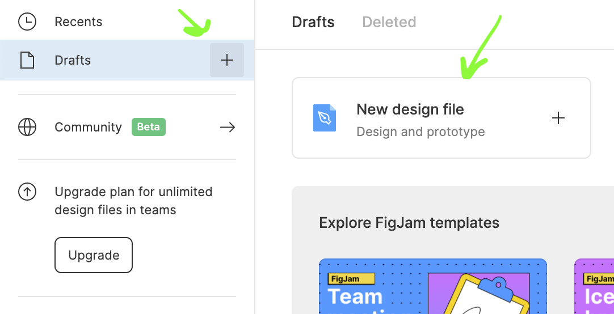

You'll see an empty workspace like this:

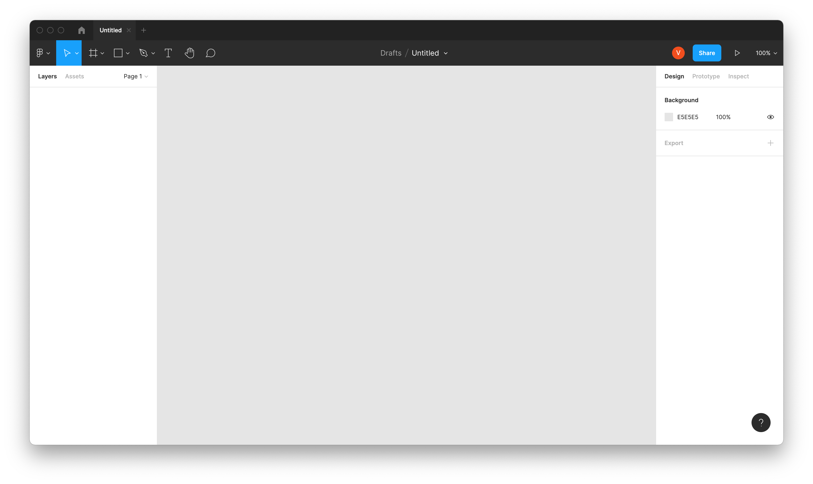
 
We'll start by creating a *frame* that resembles a mobile screen. 

Some say a share of mobile traffic is now about *56%* of the whole internet traffic! More the reason to start with the *mobile first*! Also, it's much easier to figure out essential *user interface* (UI) elements when you don't have too much space 😜.

So, let's add an iPhone screen, for starters. Press "F" or click the frame tool on the panel and select "iPhone 13 / 13 Pro":

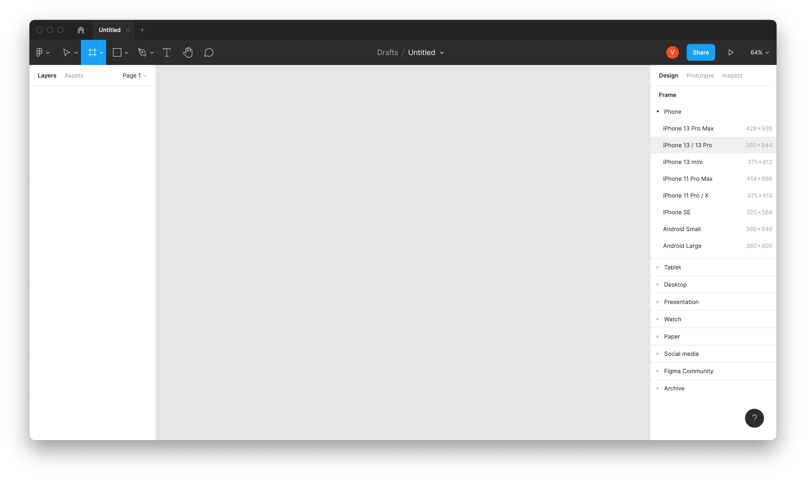
 
New frame will appear. Double click on the name in the left menu and rename it to `Feed`:

 
According to our requirements, posts have some text and an image. So let's add an image!

I bet you have some pictures laying around, but if you don't - you can grab some from [Unsplash](https://unsplash.com/) for free, just don't forget to attribute the author if you publish your creations somewhere 🤓

Just drag and drop an image from your computer to the `Feed` frame:

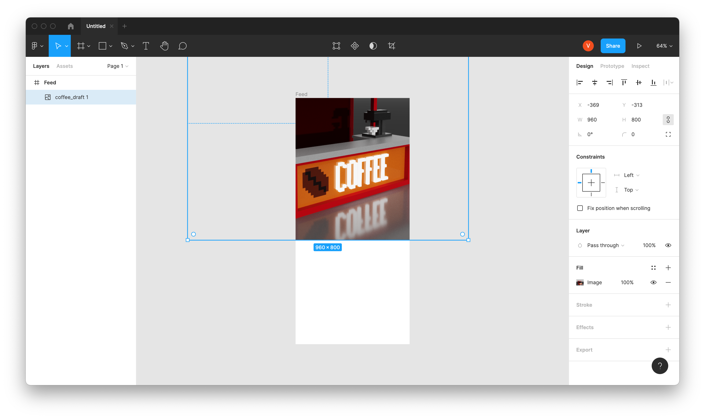
 
Oops, that's a little bit too big 😳. 

We could drag the corners to resize, or use a scale tool, but I prefer to edit element *properties* instead. 

Set `x` and `y` to `0` and `width` to `390`(width of the frame) and hit "Enter":

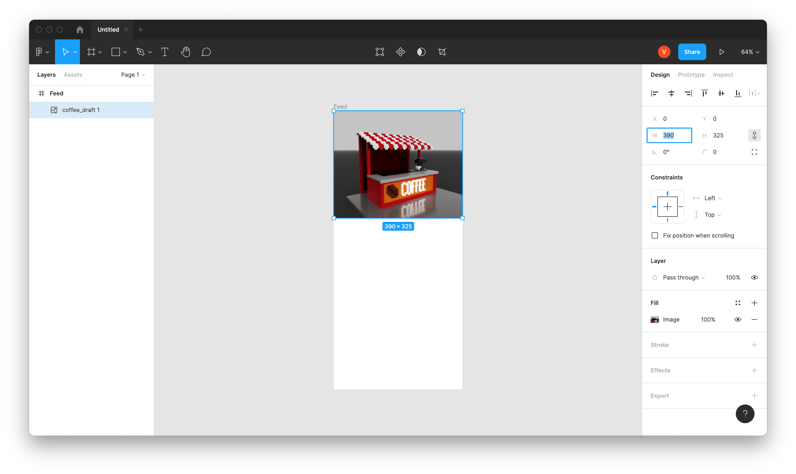
 
Much better!🤩

Now how about some text? Click "T", click somewhere on the frame and type something.
 
Hm, that's not right! Let's limit the width of the text and set height to be flexible (instead of width) in the properties:

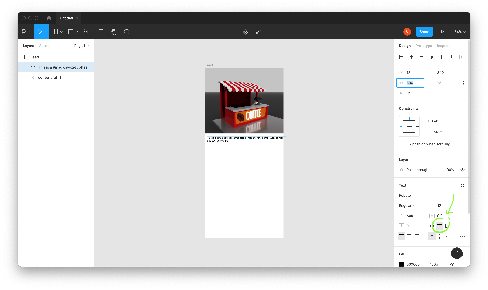
 
Now only a small portion of the text doesn't fit on the screen. I wanted to give it some *padding* on the sides, so clicked away from the border, but set the width to the full width of the frame, which *clipped* the content.

I want to have `16` pixels on each size, so I'll set `x` to `16` and width to `390-16*2`:

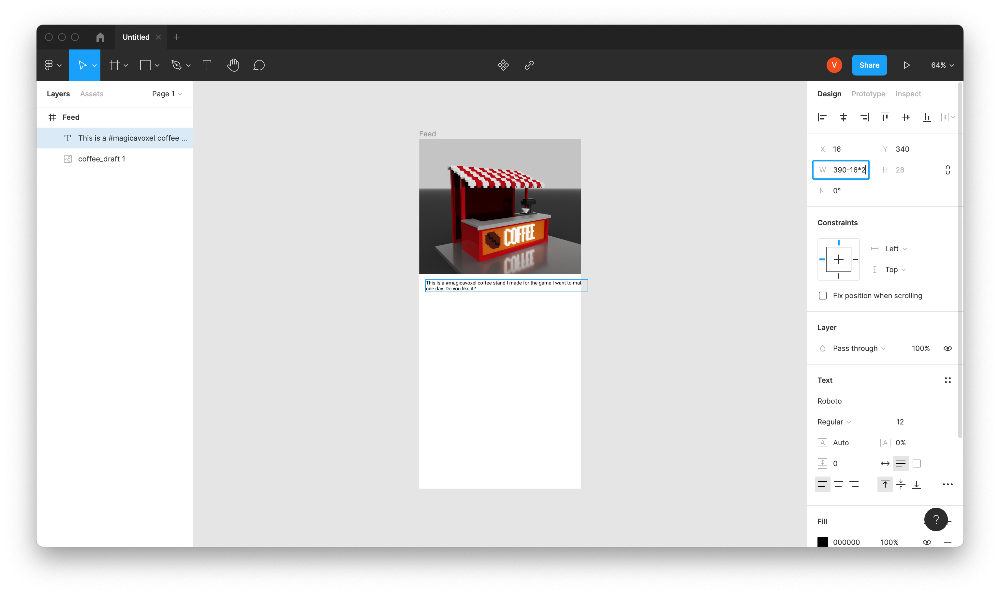
 
Press "Enter" and you'll see that the width changed to `358`. Nice, right?

I rely a lot on math when I design UI. For example, whenever I choose the width for a gap or a padding (a *whitespace*), I use numbers, divisible by `8`: 8, 16, 24, 32, etc. The more I want the item to stand out - the bigger number I choose. I often start with `16` and then adjust it to my needs.

Same goes for the text size. Therefore, let's change it to `16` too:

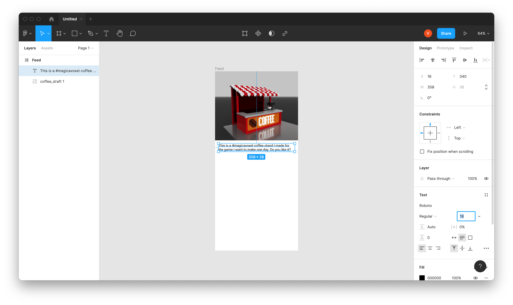
 
I want to show users that they can click on *#hashtags* to view similar posts. And the common approach to it - is to *underscore* a link. 

Double click to edit the text, select the hashtag and click "..." on the text properties panel:

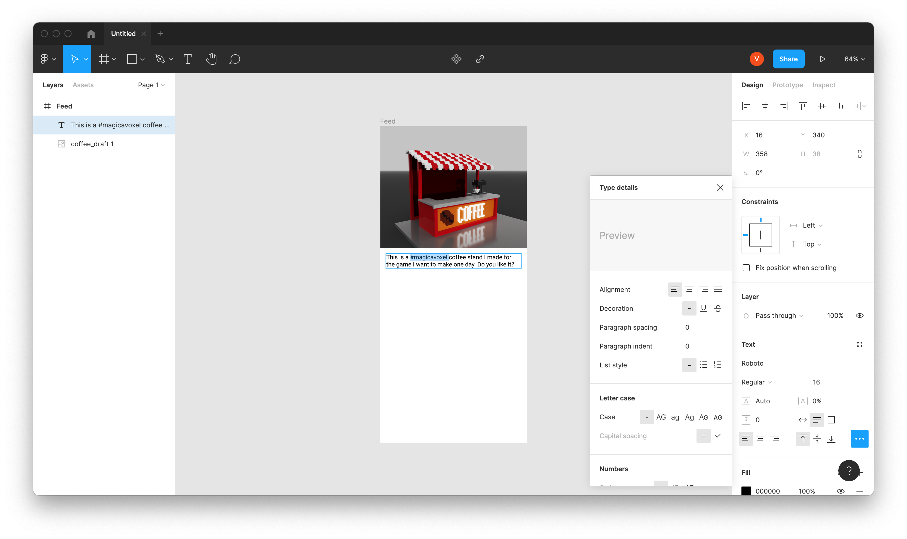
 
And then click on the "U" button:

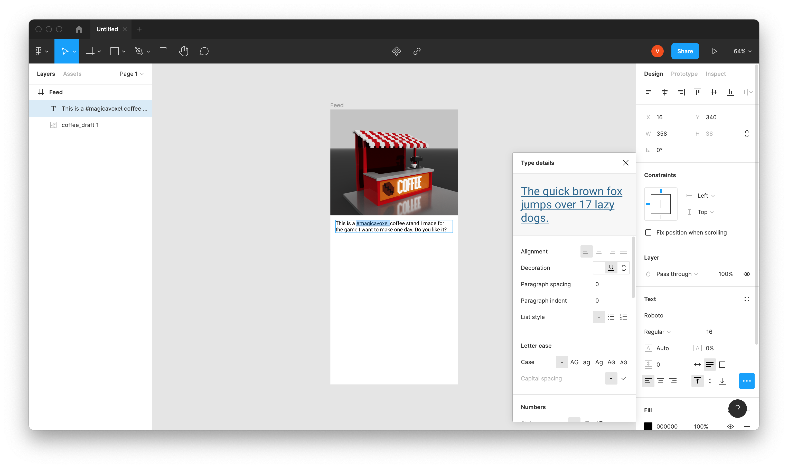
 
Nicely done! It almost looks like a post, doesn't it?

But we need more posts for our feed. We could just copy and paste it, of course, as much times as we need, but Figma has a better option for reusable elements.
 
## Components

Select both image and text by holding "Shift" and clicking on them one by one, press right mouse button and select "Create component" (or use a corresponding shortcut):

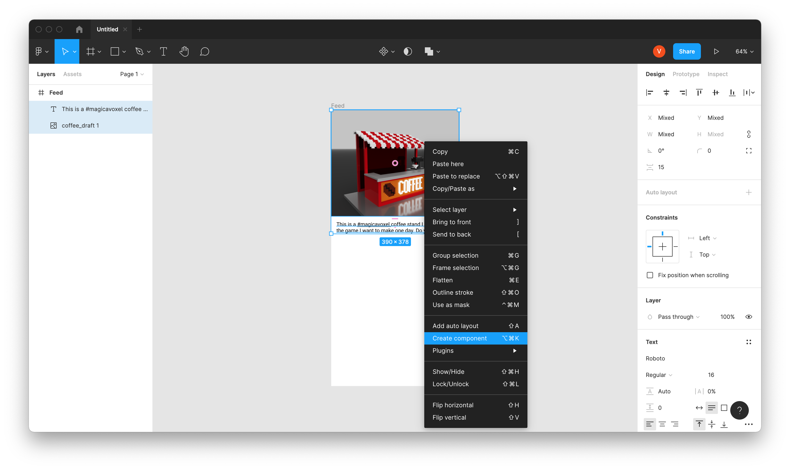
 
Double click on the name and rename it to `Post`:

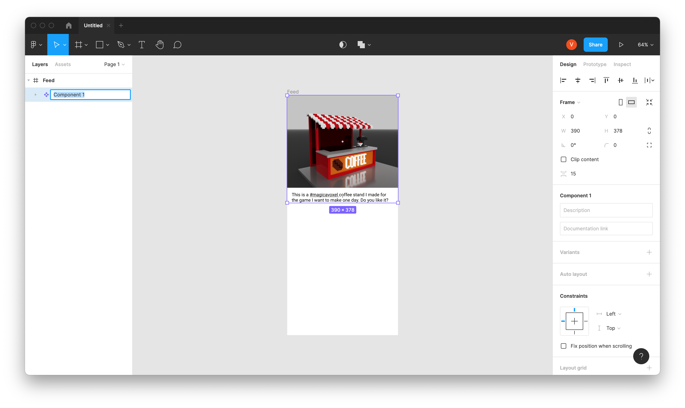
 
Now copy and paste the component (`ctrl+c`,`ctrl+v` or `cmd+c`,`cmd+v` for Mac) and drag it down:
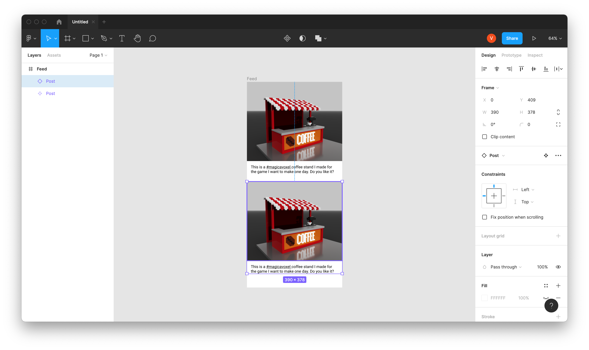
 
Let's make sure that the gap between the posts is aligned with our *design system* (that size is divisible by `8`).🧐

Select one post, move mouse over the other one and press "Alt":
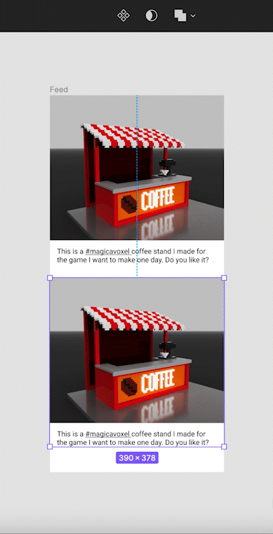
 
In my case, I was off by just one pixel 😎, so in order to fix it I only needed to press "Arrow down" one time to move the selected post down by one pixel and make it `32`.

It's not that interesting to see the same post over and over...

Let's select the second image and replace it by another picture:

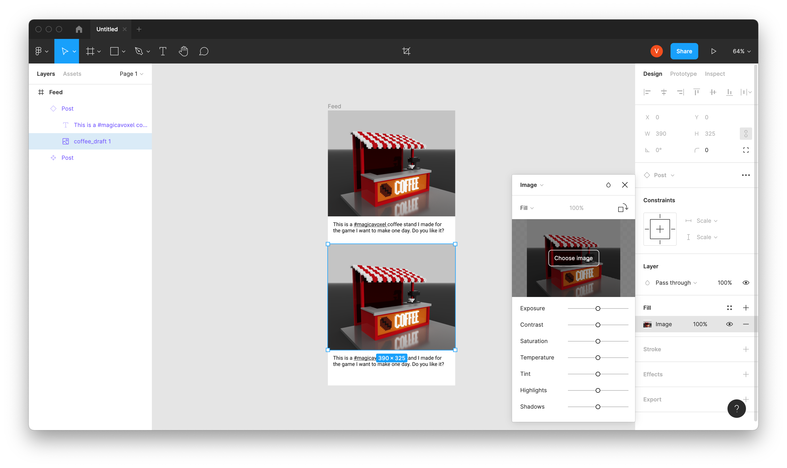
 
And the text too. You should end up with something like this:
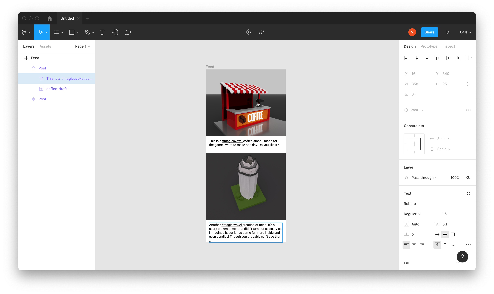
 
## Style

Current design seems very plain to me. I want to add some flavor to it, make it recognisable! Add some style!

As you've probably guessed by the pictures, I'm a big fan of *voxel* and *pixel* art, so how about we do a pixel-art inspired theme 😍?

And for us it boils down to changing the font. 

My go-to resource is [Google Fonts](https://fonts.google.com/): it offers free fonts for personal and commercial use and, so happens, it has a wonderful [VT323](https://fonts.google.com/specimen/VT323) pixel font. Download it and install to your computer.

You'll need to reload Figma to see the newly installed font in the list and be able to select it. 

When you're done, select the text of the main post component, type `VT` and let autocomplete do the rest:

 
But the other post didn't change, because Figma allows us to customise text appearance between copies of the same *component*, unless we tell it to reuse the *style*.

Click on the "Style" button by the side of "Text" in the properties and click "+" to add a new text style:

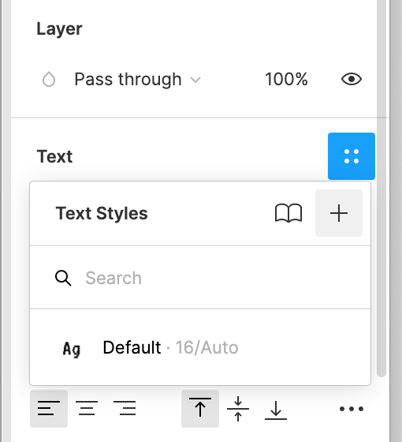
  
Call it `Default` (or whatever you prefer) and press "Create Style". Both posts now share the same style:

 
Nice! Now we are only missing a nice like button ❤️

## Icons

One icon can explain what a button do better than a thousand words (and much faster too). Figma is a *vector* editor and has some built-in shapes and first-class support for *scalable vector graphics*. You could grab an SVG icon from [FontAwesome](https://fontawesome.com/v5.15/icons) or [FlatIcon](https://www.flaticon.com/), but I suggest we make them ourselves 😎

Recently I've been playing with *WebGL* graphics and created a pixel art editor specifically for that 🥳 It's [open source](https://github.com/ValeriaVG/pixel-vg) and I have a wrote a post about it here on dev.to, if you would like to know how it works. 

Anyway, just open the [live version](https://pixel-vg-6ijid.ondigitalocean.app/), turn "X" mirroring on and start drawing a black heart outline:

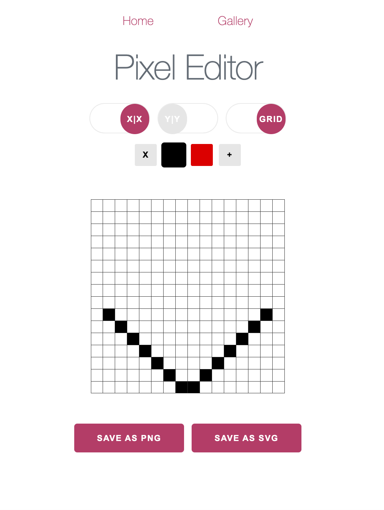

And, when you ready, press "Save as SVG". 

Here's my version , which you can use instead, if you prefer:


 
Drag and drop the SVG icon to an empty space in Figma:

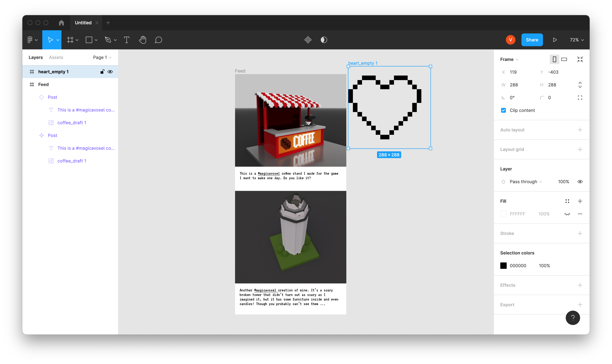
 
Expand the icon contents in the left panel and select "Vector":

 
Drag it above its frame to pull it out of the container and leave only the icon itself:
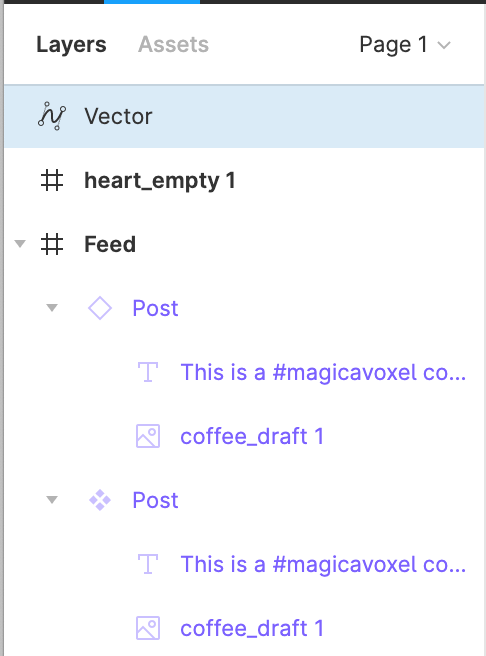

Get rid of the empty frame by selecting it alone and pressing "Backspace". 

Rename "Vector" to `Heart`.
 
Change the heart size to something more suitable for an icon by activating "Constrain proportions" and setting one of the sizes to e.g. `24`:

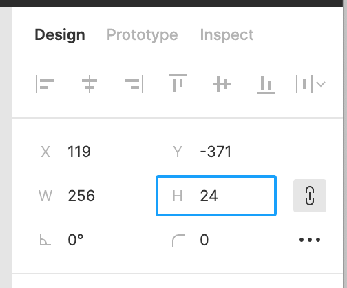
 
Create a component from the heart, just like we did with the post before. 

Click on a "+" next to "Variants" with the icon component selected:

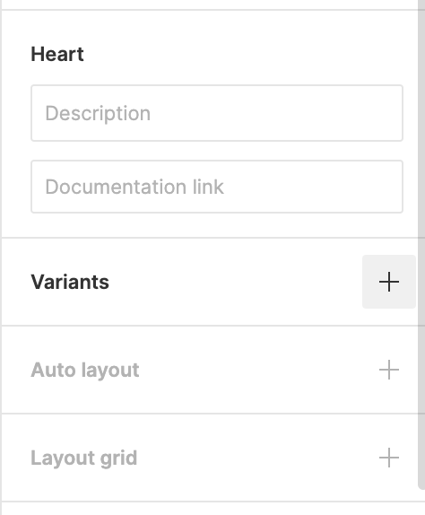
 
Name the variant `Filled`:
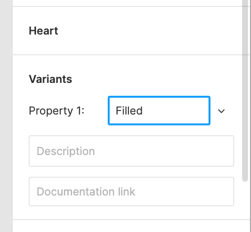
 
Select the "Heart" (not the "Default" or "Filled" variant) on the left:
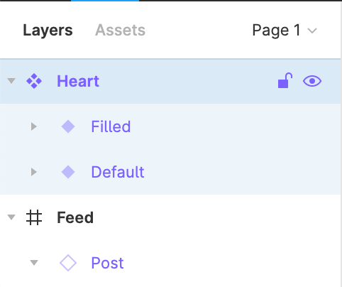
 
Double click on "Property 1" in parameters and change it to `State`:
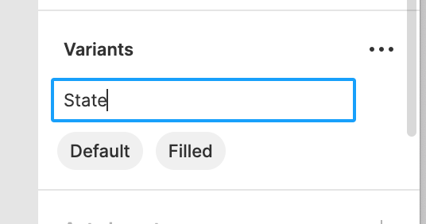
 
Now expand the "Filled" variant, select the underlying "Heart" and click "Edit Object" icon on the top and use "Paint bucket" to fill the icon and then press "Done":
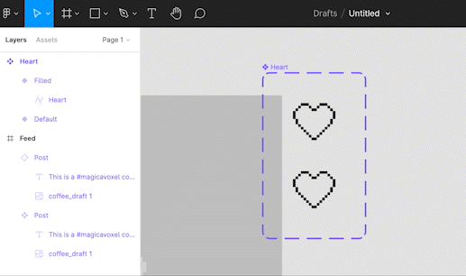

Now we can switch between these *variants* whenever we want! 

Select the "Default" heart, copy it, then select the post *component* & paste:

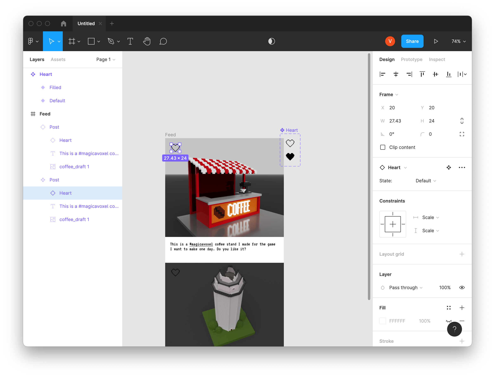
 
The same icon with appear on the other post as well. Select that other icon and change "State" to "Filled" on the "Heart" properties panel:
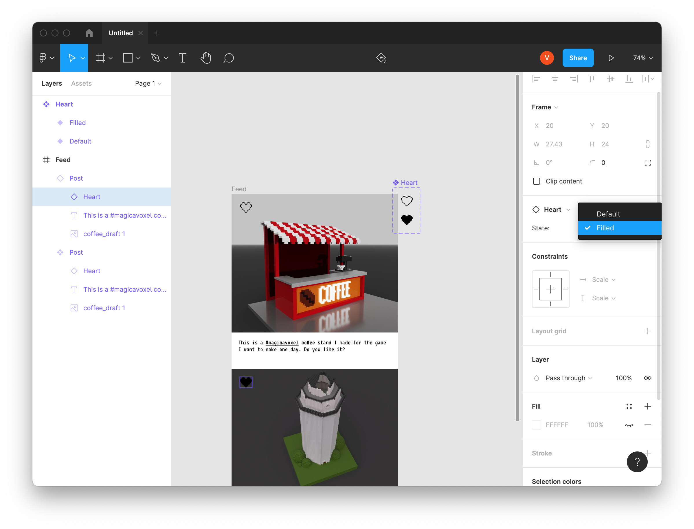
 
The icon is barely visible on my images, let's change it's color to white by scrolling the properties panel and changing "Selection color":

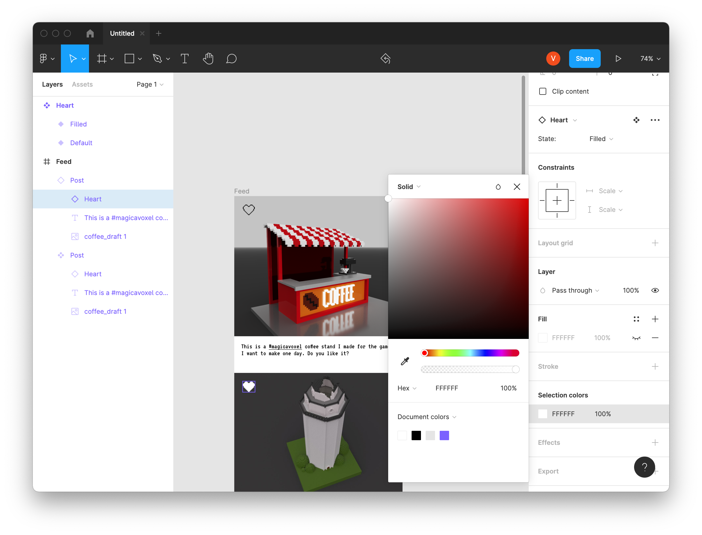

We could go ahead and change the other one as well, but I prefer to add another variant to the icons!

Select the "Heart" component and click on the "..." and "Add property", call it `Color`:
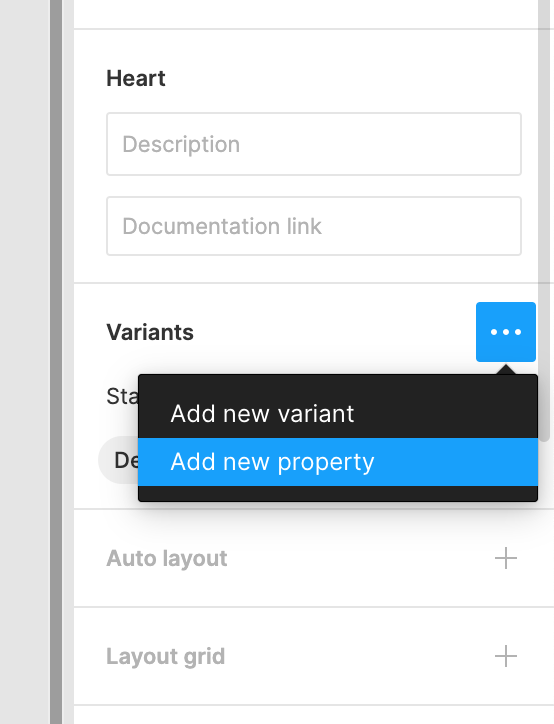
 
Add two new variants: `Dark` and `Light`, by pressing "+" with icon you want to clone selected:
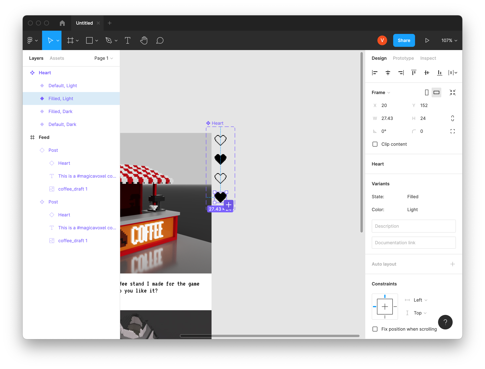
 
Change "Selection color" for the light icons:
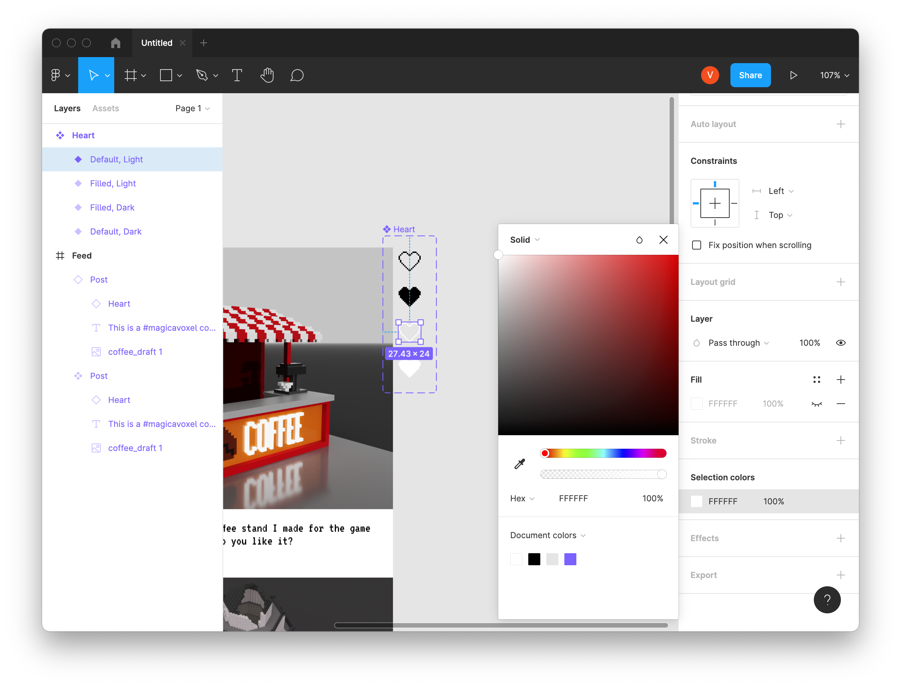
 
And finally, change the "Color" property on the post *component* to "Light":

Here's my final version:
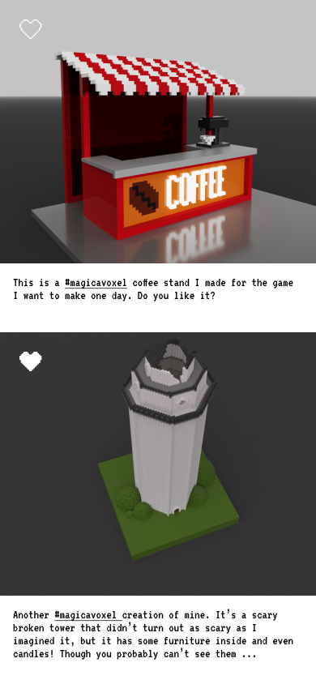
 

I think it looks nice, doesn't it? 🤩
 
## Bonus challenge

Want to try something on your own?
Here's a suggestion!

Add two more items to the post *component*:
- Date, when the post was published
- Author name and avatar

Also, add a short *variant* to a post: without an image. 

Show both variants the feed.

How would you visually separate them? 🧐

Till the next time! And good luck!