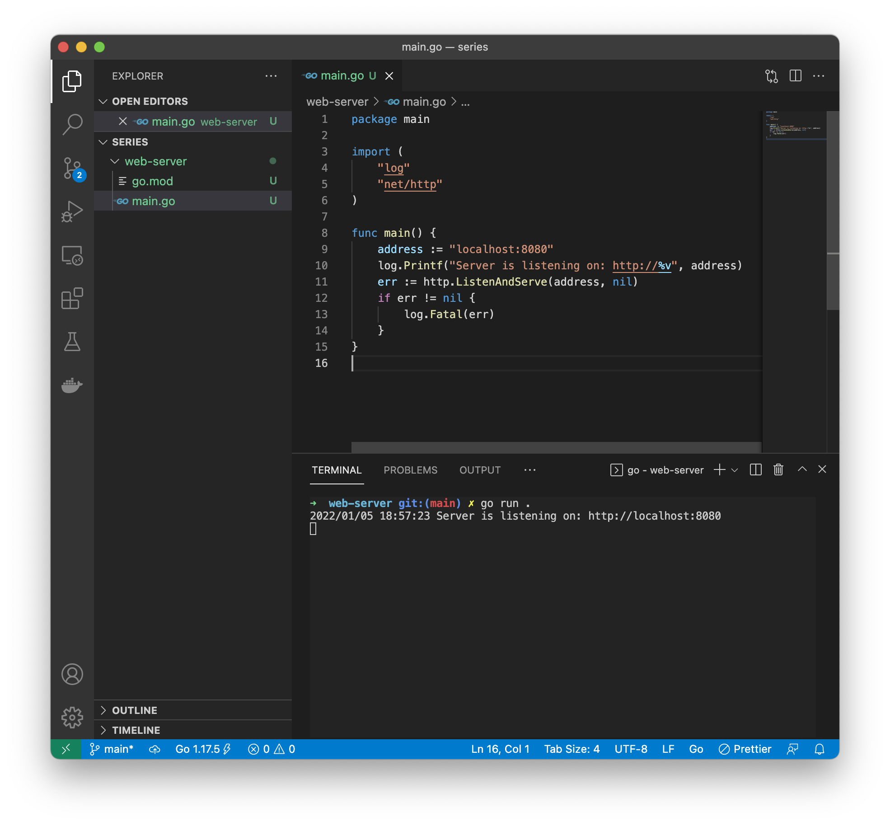
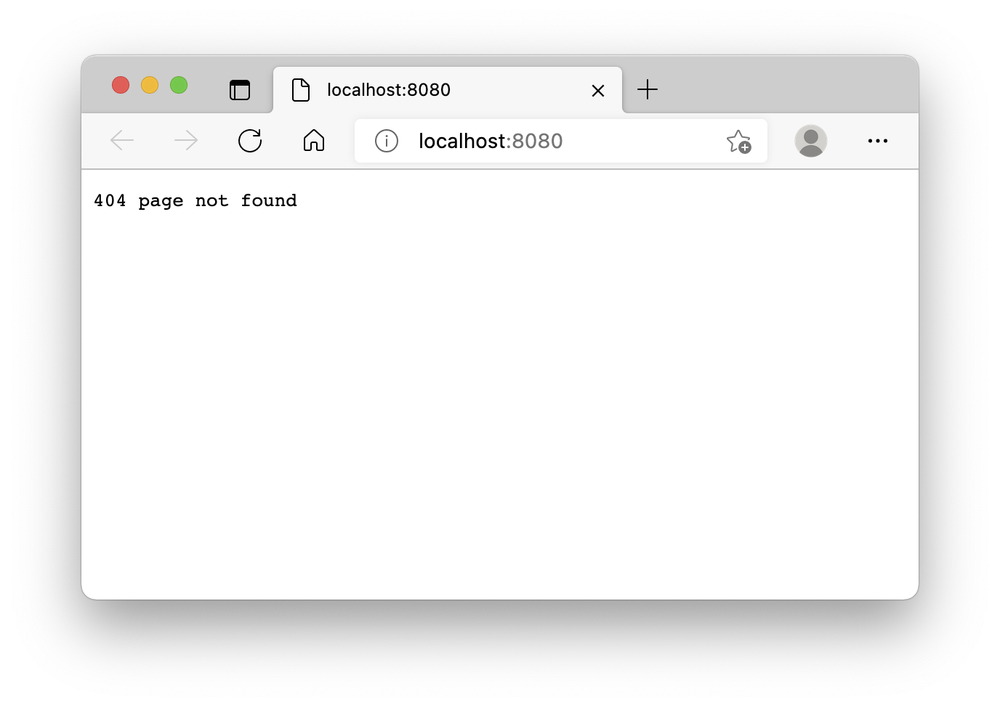
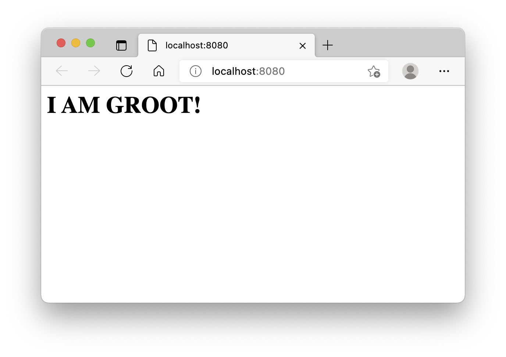

Throughout this series you will be building a social network that you could turn into your very own niched service 😎

But worry not, you won't need to do it all at once! We'll take it one step at a time and we'll start from the very beginning.
<!--more-->
Today you are going to setup your development environment and build a minimalistic web server in Go.

Sounds interesting? Let's get started then.

## Grab the tools

Every self-respecting developer has a code editor 😎. 
If you don't have one yet, go ahead and grab [VSCode](https://code.visualstudio.com/). There are others, of course, but this one is good enough and free enough 😉
 
I mentioned that you'll be learning Go. That's a very powerful, yet easy to grasp language. And it has been widely adopted by the giants of tech industry so you won't have issues finding a juicy gig too 🤑

If you haven't installed Go *compiler* yet, go ahead, download it from [go.dev](https://go.dev/) & install.

And last, but not least, you'll need a Go plugin for your code editor. If you're using VSCode get this [Official Go Plugin](https://code.visualstudio.com/docs/languages/go).

All set? Nice job 👍 

## The First Web Server

You'll need some descriptive name for your first project: something nice but short, like `web-server`.

Open your code editor and then a new *terminal* within the editor. In VSCode you can do it by selecting "Terminal" -> "New Terminal" from the top menu.

To create a new Go project, type these commands in the terminal:
```sh
mkdir web-server
cd web-server
go mod init web-server
```

You should now see `go.mod` with the name of the project and Go version:


Create a file called `main.go` by the side of `go.mod` file:

```go
package main

import (
	"log"
	"net/http"
)

func main() {
	address := "localhost:8080"
	log.Printf("Server is listening on: http://%v", address)
	err := http.ListenAndServe(address, nil)
	if err != nil {
		log.Fatal(err)
	}
}
```

To run the server type in terminal:
```go
go run .
```

You should see something like that:


If you see this error instead:
```sh
2022/01/05 19:03:33 Server is listening on: http://localhost:8080
2022/01/05 19:03:33 listen tcp 127.0.0.1:8080: bind: address already in use
exit status 1
```

Change the *port* number in the address to another value, e.g. `8081`, and try again.
 
If you navigate your browser to [http://localhost:8080](http://localhost:8080) (or the address you're using), you'll see:



It may not seem like one yet, but this thing that you've just made is a real *HTTP* server.

We'll dive deeper into the protocol itself further down the road, for now let's blindly trust `net/http` package on it 😁

The `main.go` file starts with `package main`. Every Go file in the root of this directory should start exactly the same way. And, expectably, nested packages should be located in nested directories and called accordingly.

Next, we are importing two packages from the standard library:
```go
import (
	"log"
	"net/http"
)
``` 

This tells the compiler to include code from these packages in addition to the code in the `main.go` file. 

And then the `main` function. You can have other functions here too, for example: 
```go
func aFunction(){}
func anotherFunction(){}
func main(){
/** **/
}
```
But, unless you *call* other functions from inside `main`, they won't be executed. So `func main` in a `main.go` file is the entry point for any *executable* project.

And, finally, the contents of the `main` function begin with a *variable* called `address`, that we are *assigning* the value of `localhost:8080`. 

If you hover over the variable name in your code editor, you'll see a hint like this:
```go
var address string
```

That's because operator `:=` tells the compiler to *infer* a type based on its value. You could explicitly *define* the variable and assign a value to it too, works either way:
```go
var address string = "localhost:8080"
```

Next up we are logging the full server address:
```go
log.Printf("Server is listening on: http://%v", address)
```

To do so we are calling a `Printf` function from the `log` package. The first *parameter* is a string with a placeholder `%v`, which means *use the default format*. And the next parameter is what we want to replace the placeholder with.

So if we'd want to format multiple things we would add multiple placeholders:
```go
log.Printf("Server is listening on: http://%v:%v","localhost","8080")
```

It's an easy way to compose strings and if you want to learn more, take a look at [fmt package documentation](https://pkg.go.dev/fmt).

Finally we got to the most important line:
```go
err := http.ListenAndServe(address, nil)
```

As the name suggests, it calls `ListenAndServe` function from the `net/http` package and passes string address and a `nil` as arguments.

We don't really need the second argument, but in Go if a function requires an argument - you should pass an argument, you can't just skip it. And `nil` means nothing in this case. Literally.

Function `ListenAndServe` returns an error, e.g. if it fails to bind the port. When there is no error its value will be `nil`, that's why we check for it:

```go
if err != nil {
  log.Fatal(err)
}
``` 

And, if so happens that there was an error, we log it and shut the server, that what `log.Fatal` does.

Phew, that was as long one. I'm glad you made it this far 😅

## Serving Content

You've built a web server, but it doesn't do anything.
How about we make it *respond* with something more interesting?

Add a new function to `main.go`:
```go
func HomePage(w http.ResponseWriter, req *http.Request) {
	w.Write(([]byte)(`<html><body><h1>I AM GROOT!</h1></html>`))
}
```

And add a line before `ListenAndServe` call inside the `main` function:
```go
func main() {
	address := "localhost:8080"
	log.Printf("Server is listening on: http://%v", address)
	http.HandleFunc("/", HomePage) // <- Add this line
	err := http.ListenAndServe(address, nil)
	if err != nil {
		log.Fatal(err)
	}
}
```

Stop server with `ctrl+c` and start it again.
You should see a huge header in your browser now:


As you've probably guessed, we added a *handler* to the server and pointed out that we would like to process all the requests, starting with the path `/` with the `HomePage` function:

```go
http.HandleFunc("/", HomePage)
```

Now the `HomePage` function needs to have proper *type*, that means the arguments and return values need to be exactly the way `http.HandleFunc` wants it to be, and therefore we ended up with the following signature:

```go
func HomePage(w http.ResponseWriter, req *http.Request) {
```

The first parameter is, as the name suggests, a response writer and the second one is a *pointer* to the request that we are processing. Pointer types start with `*` and mean that they are references to values, not the values itself.

The actual work happens inside the body of the `HomePage`:
```go
w.Write(([]byte)(`<html><body><h1>I AM GROOT!</h1></html>`))
```

We take this (stripped) HTML page text:
```html
<html><body><h1>I AM GROOT!</h1></html>
```

Turn text into a *slice* (sequence) of *bytes*:
```go
([]byte)(some_text)
```

The parenthesises around the `byte[]` are there just to wrap the type, since it has the `[]` part.If we'd want to convert the other way around we'd do:
```go
string(some_bytes)
```

And finally, we send the page to the *client*, that initiated *request*, by calling `w.Write`.

Woohoo! We built a server! 🥳

## But did we *build* a server?

Ooops, you're right, we have been using `go run` so far, but `go` compiles to an *executable* program with ease!

Stop the server (`ctrl+c`) and type in terminal:
```sh
go build .
```

You'll see new file called `web-server`. 

Unix/MacOS users need to allow its execution with:
```sh
chmod +x web-server
```

Otherwise you can run it like any other program.

For Unix:
```sh
./web-server
```

Or, for windows:
```
.\web-server.exe
```

Good job! You've made it till the end! 👏

## Bonus Challenge

Hungry for more? Here's a challenge for you 💪:

Take this *unit test* file:


Place it by the side of `main.go` and make sure it passes when you run:

```sh
go test .
```

You are only allowed to make changes to the `main.go` file though!

See you next time! And good luck!