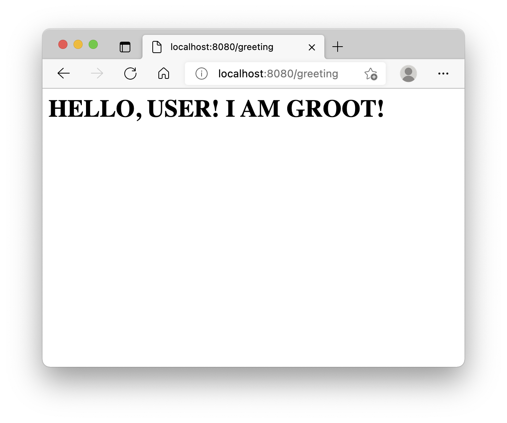
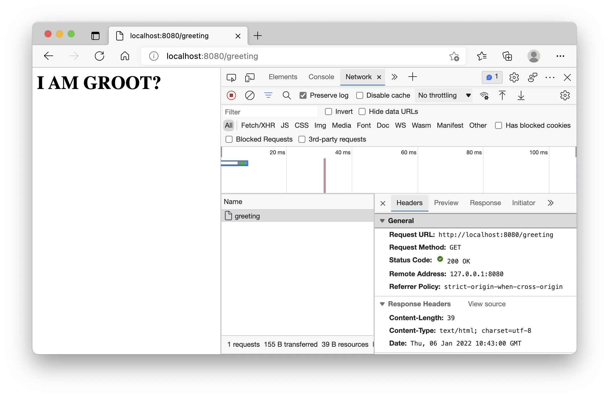

Brace yourselves, I'm eager to start building the actual social network, so I'm stuffing as much material as possible in this introduction.
<!--more-->
In the previous article we've built a tiny HTTP server that was saying "I AM GROOT" in huge bold letters. 

But what was actually happening under the hood?

## HTTP: HyperText Transfer Protocol

As the name suggests, it is a protocol to transfer text. I'll tell you more: it's a *text-based* protocol. Take a look at that:

```
HTTP/1.1 200 OK
Date: Thu, 06 Jan 2022 07:45:04 GMT
Content-Length: 39
Content-Type: text/html; charset=utf-8

<html><body><h1>I AM GROOT!</h1></html>
```

That is a *HTTP response* sent by the web server from the previous article. If you remember, we have only wrote the last part of it - the response *body*; the *header* was added by the `net/http` package:

- `HTTP/1.1` is the name and version of the protocol
- `200 OK` is the code for "OK", as you've probably guessed, it could've been `404 NOT FOUND` or `500 INTERNAL SERVER ERROR`🙀 or any other [HTTP Response status codes](https://developer.mozilla.org/en-US/docs/Web/HTTP/Status) 
- `Date`,`Content-Length` and `Content-Type` as the [*response headers*](https://developer.mozilla.org/en-US/docs/Glossary/Response_header)

But don't trust me on this one! Ask `curl` instead!

[Curl](https://curl.se/) is a small command-line tool that's "transferring data with URLs since 1998". Chances are you already have it installed on your machine, so just give it a try in your terminal and, if it doesn't work, go and grab it from [here](https://curl.se/download.html):
```sh
curl --version
```

The commands that I use the most are `curl <url>`, which just prints the response body to a terminal, and `curl <url> -I`, which prints only the headers.

To see the raw HTTP response, similar to the one I showed you, start the server from the previous article and type in your terminal:
```sh
curl -D - http://localhost:8080
```

Congratulations, you can now read raw HTTP! You don't need to, you have a browser for it, but you can 😏

But there's the other side to it - if you can read *responses*, there must be a way to write *requests*, right?

Right! It looks very similar to the responses, why wouldn't it:
```
GET / HTTP/1.1
Host: localhost
User-Agent: curl/7.54.0
Accept: */*

```

This request doesn't have any *body*, that's why it ends with two empty lines or, to be precise, two [CRLF: Carriage Return and Line Feed `\r\n`](https://developer.mozilla.org/en-US/docs/Glossary/CRLF) sequences.

The first line starts with a [HTTP Method](https://developer.mozilla.org/en-US/docs/Web/HTTP/Methods) `GET` and a *path* `/` and ends with a familiar protocol version.

And, similar to a response, [*request headers*](https://developer.mozilla.org/en-US/docs/Glossary/Request_header) come next.

In this case we are intending to *get* a response from the root path, and therefore performing a `GET /` request with no body, but we could also try to *post* something:

```
POST /some/other/path HTTP/1.1
Host: localhost
User-Agent: curl/7.54.0
Accept: */*
Content-Length: 6

Hello!
```

Want to try it yourself? Save the request to a file, e.g. `raw.txt` and type this in the terminal:
```sh
nc localhost 8080 < raw.txt
```

If you are on Windows and this command is not recognised, install NetCat as suggested [here](https://stackoverflow.com/questions/34924089/windows-7-netcat-error-nc-is-not-recognized-as-an-internal-or-external-comman#49718027).

You've probably noticed, that the web server we've built responds with the exact same thing, no matter what requests we are making. Let's fix that!

## RESTful API

We would like to differentiate between request methods (`GET`,`POST`,`PUT`,`DELETE` etc) and between the paths (`/`,`/items`,`/item/1` etc). And, a top of that, wouldn't it be nice for paths and verbs to make sense together? It's easy to guess what `POST /image` and `DELETE /user/1` do and predict other paths. Congratulations, we've re-invented *REST API*!

Now let's implement it. That's where we left off the last time:
```go
//main.go
package main

import (
	"log"
	"net/http"
)

func main() {
	address := "localhost:8080"
	log.Printf("Server is listening on: http://%v", address)
	http.HandleFunc("/", HomePage)
	err := http.ListenAndServe(address, nil)
	if err != nil {
		log.Fatal(err)
	}
}

func HomePage(w http.ResponseWriter, req *http.Request) {
	w.Write(([]byte)(`<html><body><h1>I AM GROOT!</h1></html>`))
}
```

Our home page screams `I AM GROOT`, so how about we add a way to `POST /greeting`?

Add a new function after `HomePage`:
```go
func GreetingPage(w http.ResponseWriter, req *http.Request) {
	name := "USER"
	html := fmt.Sprintf(`<html><body><h1>HELLO, %v! I AM GROOT!</h1></html>`, name)
	w.Write(([]byte)(html))
} 
```

For now, we've *hard-coded* the name as `USER` and added it to the page content using `fmt.Sprintf`. We've done same as before with the `log.Printf`, except this time we did not need to print the resulting string in the terminal, just to get the string itself.

> VSCode should automatically add packages you are using to the list of imports, but do check that `fmt` was indeed added there.

Let's add one more handler to the `main` function:
```go
func main() {
	address := "localhost:8080"
	log.Printf("Server is listening on: http://%v", address)
	http.HandleFunc("/", HomePage)
	http.HandleFunc("/greeting", GreetingPage) // <- Add this line
	err := http.ListenAndServe(address, nil)
	if err != nil {
		log.Fatal(err)
	}
}
``` 

Now, if you navigate to [http://localhost:8080/greeting](http://localhost:8080/greeting), you'll see:


 
And, if you come back to [http://localhost:8080/](http://localhost:8080/), the content will be the same as before.

Not bad! We've got ourselves a multi-page website 😎

Let's make the server say `I AM GROOT?` in response to `GET /greeting` and answer with `HELLO, <name>! I AM GROOT!` (in extended *groot* language) every time someone sends a `POST /greeting` with the name as a request body (in plain text).

If you've dared to try the bonus challenge from the previous article, you are already familiar with test-driven development. It's okay if you haven't, you will be now 😏

Go comes with a bunch of useful tools to check `go vet`, format `go fmt` and test `go test`, to name a few. The latter is the *test* runner, as you've probably figured.

Create a file called `main_test.go` by the side of `main.go`:
```go
package main

import (
	"fmt"
	"io/ioutil"
	"net/http"
	"net/http/httptest"
	"strings"
	"testing"
)

func TestGetGreeting(t *testing.T) {
	req := httptest.NewRequest(http.MethodGet, "/greeting", nil)
	w := httptest.NewRecorder()
	GreetingPage(w, req)
	res := w.Result()
	defer res.Body.Close()
	got, err := ioutil.ReadAll(res.Body)
	if err != nil {
		t.Fatal(err)
	}
	expected := "<h1>I AM GROOT?</h1>"
	if !strings.Contains(string(got), expected) {
		t.Errorf("Expected to find %q in %q", expected, got)
	}
}

func TestPostGreeting(t *testing.T) {
	name := "YOUR NAME"
	req := httptest.NewRequest(http.MethodPost, "/greeting", strings.NewReader(name))
	w := httptest.NewRecorder()
	GreetingPage(w, req)
	res := w.Result()
	defer res.Body.Close()
	got, err := ioutil.ReadAll(res.Body)
	if err != nil {
		t.Fatal(err)
	}
	expected := fmt.Sprintf("HELLO, %v!", name)
	if !strings.Contains(string(got), expected) {
		t.Errorf("Expected to find %q in %q", expected, got)
	}
}
```

Every function that starts with a `Test` in a test file will be executed when we run `go test .`:
```
--- FAIL: TestGetGreeting (0.00s)
    main_test.go:24: Expected to find "<h1>I AM GROOT?</h1>" in "<html><body><h1>HELLO, USER! I AM GROOT!</h1></html>"
--- FAIL: TestPostGreeting (0.00s)
    main_test.go:41: Expected to find "HELLO, YOUR NAME!" in "<html><body><h1>HELLO, USER! I AM GROOT!</h1></html>"
FAIL
FAIL    web-server      0.010s
FAIL
```

As expected, both of the tests are failing and we'll make them pass in no time, but first, let me walk you though what you just wrote 🤗

Both functions are very similar, in each one of them we are using `net/http/httptest` package to *mock* a request to a server. The function `GreetingPage` expects a certain type of arguments and, if we pass arguments that do not meet the requirements, the program won't compile.

So what are the requirements? In Go it's called an *interface*. An interface dictates that whatever your entity is it must have certain *methods* implemented. For example `http.ResponseWriter`, comments aside, looks like this:
```go
type ResponseWriter interface {
	Header() Header
	Write([]byte) (int, error)
	WriteHeader(statusCode int)
}
```

And `httptest.ResponseRecorder` is a *struct* that has these methods wired to store results in memory:
```go
type ResponseRecorder struct {
	Code int
	HeaderMap http.Header
	Body *bytes.Buffer
	Flushed bool
	result      *http.Response 
	snapHeader  http.Header 
	wroteHeader bool
}

func (rw *ResponseRecorder) Header() http.Header {
	m := rw.HeaderMap
	if m == nil {
		m = make(http.Header)
		rw.HeaderMap = m
	}
	return m
}
```

Once again I've stripped the comments for brevity, but I do recommend you to `cmd+click` (Mac) or `ctrl+click` in your code editor on the names of these methods and take a look at the source code for yourself.

So, we are creating couple of structures that has methods required for request and response arguments:
```go
req := httptest.NewRequest(http.MethodGet, "/greeting", nil)
w := httptest.NewRecorder()
```

In the `TestGetGreeting` we, erm, test `GET /greeting` without the body, so we pass `http.MethodGet`(it's a *constant* "GET"), path `/greeting` and `nil` for body.

In the `TestPostGreeting` we change the method to `http.MethodPost` (constant "POST") and pass a body:
```go
name := "YOUR NAME"
req := httptest.NewRequest(http.MethodPost, "/greeting", strings.NewReader(name))
w := httptest.NewRecorder()
```

Requests, just like responses, can be quite long (a two hour Netflix movie in 4K would weight around 11.4 GB) and that wouldn't fit into one *package*. You see, while HTTP is just a text, it is still being carried between you and the server wrapped in small binary packages (up to 64k bytes tops).

On a lower lever, every time you type `https://www.google.com/`in your browser here's what's going on:

- Your browser is looking up the *IP* address for `www.google.com`, you could mimic it with:
```sh
nslookup www.google.com
Server:		192.168.1.1
Address:	192.168.1.1#53

Non-authoritative answer:
Name:	www.google.com
Address: 142.250.74.4
```
- Your browser initiates a `TCP` connection with that address
- If the requested protocol is `HTTPS`, it would initiate a secure connection and everything that you send will be encrypted so that only the server could make sense of your request
- With the open TPC connection, the client (browser) will start packing your `HTTP Request` and sending over to the server
- The server will start sending response packages
- The client will unpack & decrypt the response
- And, when done, close the connection

With that in mind, you'll probably understand why you can't just pass a string to the `httptest.NewRequest` and instead create a *reader* from `strings` package, that allows reading byte slices instead:

```go
strings.NewReader(name)
```

And these lines also start to make sense, right? We need to be able to tell when the whole *request body* is sent and wait till the whole *response body* is received to be able to do something with it:
```go
GreetingPage(w, req)
res := w.Result()
defer res.Body.Close()
got, err := ioutil.ReadAll(res.Body)
```

The `defer` keyword means "do it when you're done with the rest", or in technical terms, delays the operation till the surrounding function returns. I prefer to read it as "don't forget to", so, in this case, we use it to *eventually* close the request body:
```go
defer res.Body.Close()
```
We could write this line anywhere after the `res` variable is defined, it'll work just the same. Very handy when you deal with *async* operations!

Next, we are reading all the parts of the body with `ReadAll` from package `ioutil`:
```go
got, err := ioutil.ReadAll(res.Body)
```

And if something went wrong, for example the connection got lost, we'll stop the test with:
```go
if err != nil {
  t.Fatal(err)
}
```

Where the `t` is the argument of the test function:
```go
func TestPostGreeting(t *testing.T) {
//...
}
```

See the `*` in front of the type? Yup, it's a *pointer* again. In most cases Go allows you treat them as common variables, so we wouldn't guess if it's a pointer or not from just looking at the body of the function. We'll be using pointers over and over throughout the series, but if you want to dig deeper right now - take a look at the [gobyexample.com/pointers](https://gobyexample.com/pointers).

And finally, once we are done with all the preparations, we check if the response we received matches the one we expected and fail the test if it doesn't:
```go
expected := fmt.Sprintf("HELLO, %v!", name)
if !strings.Contains(string(got), expected) {
	t.Errorf("Expected to find %q in %q", expected, got)
}
```

We could compare the exact values, but it's a good idea to check only for the part you are interested in, so that when you decide to add a `<title>Groot Server</title>` the tests won't start failing.

Phew! You've made it here! Great job! Even if the tests are still failing...

They say "it's hard while learning, easier when fighting", same goes for the tests: writing the actual implementation is often easier than writing a test. But it doesn't mean you shouldn't! Quite the opposite, as your project grows more and more, you'll often change your code, yet the tests will stay the same - guarding your project from making the same mistakes over and over again.

I hope you'll adapt and preach *TDD* (test driven development) too 😇 Now let's make the tests pass!

Change the `GreetingPage` to:
```go
func GreetingPage(w http.ResponseWriter, req *http.Request) {

	var html string
	switch req.Method {
	case http.MethodHead:
		{
			w.WriteHeader(http.StatusOK)
		}
	case http.MethodGet:
		{
			html = `<html><body><h1>I AM GROOT?</h1></html>`
		}
	case http.MethodPost:
		{
			name, err := ioutil.ReadAll(req.Body)
			if err != nil {
				log.Println("Error /greeting", err)
				w.WriteHeader(http.StatusInternalServerError)
				return
			}
			html = fmt.Sprintf(`<html><body><h1>HELLO, %s! I AM GROOT!</h1></html>`, name)
		}
	default:
		{
		w.Header().Set("Allow", "GET,POST,HEAD")	 
w.WriteHeader(http.StatusMethodNotAllowed)
			
		}
	}

	w.Write(([]byte)(html))
}
```

And, voilà:
```sh
go test .
ok      web-server      0.009s
```

We can be certain it works in the browser and curl too, as the packages we used are also well tested, but never hurts to check:

```sh
curl -X POST -d "Me" http://localhost:8080/greeting
```

Will yield:
```html
<html><body><h1>HELLO, Me! I AM GROOT!</h1></html>
```

And the `GET /greeting`, that the browser performs when you load a page will result in:

 
And if we try a different request, let's say a `DELETE /greeting`:

```sh
curl -X DELETE http://localhost:8080/greeting -I
```

We'll get:
```
HTTP/1.1 405 Method Not Allowed
Allow: GET,POST,HEAD
Date: Thu, 06 Jan 2022 10:45:36 GMT
Content-Length: 0


```

By now, you've probably figured how it works, but, just in case, let's go over what we've just implemented. 

First, we've replaced hard-coded `name` with a data from the request:
```go
name, err := ioutil.ReadAll(req.Body)
```

Then, we handled errors like a pro, by logging the error and responding with an *500 Internal Server Error* code:
```go
if err != nil {
				log.Println("Error /greeting", err)
				w.WriteHeader(http.StatusInternalServerError)
				return
			}
```

Then, because our `name` variable is no longer a string, we changed the format to explicit string conversion `%s` instead of `%v`, which otherwise would write something like `HELLO, [10, 20,...]`:

```go
html = fmt.Sprintf(`<html><body><h1>HELLO, %s! I AM GROOT!</h1></html>`, name)
```

And we wrapped it all with a `switch`, branching our responses based on the request method:
```go
var html string

switch req.Method {
  case http.MethodHead:{/**/}
  case http.MethodGet:{/**/}
  case http.MethodPost:{/**/}
  default:{/**/}
}

w.Write(([]byte)(html))
```

We've handled `HEAD`, `GET` and `POST` methods and the `default` case handled all the other, stating that the method was not allowed and providing available options as a comma-separated list in `Allow` header, like this:

``` 
HTTP/1.1 405 Method Not Allowed
Allow: GET,POST,HEAD
Date: Thu, 06 Jan 2022 11:02:14 GMT
Content-Length: 0


```

But we didn't set `html` variable to anything, why did it not crash? Well, that's one of the things I like about Go - most variables are defined with *empty* values. In case of string it's a `""` and for a number it'd be a `0`. This works for `struct` too:
```go
package main

import (
	"fmt"
)

type Counter struct {
	count int
}

func main() {
	var c Counter
	fmt.Println(c.count)
	c.count++
	fmt.Println(c.count)
}
// Prints:
// 0
// 1
```

And you've already met `nil`. That's a starting value for *pointers*, *slices*, *maps*, *channels*, *interfaces* and function variables. And therefore this won't work:
```go
func main() {
	var c *Counter
	fmt.Println(c.count)
	c.count++
	fmt.Println(c.count)
}
// panic: runtime error: invalid memory address or nil pointer dereference
```

Unless you give the pointer something to point at:
```go
func main() {
	var c *Counter = &Counter{}
	fmt.Println(c.count)
	c.count++
	fmt.Println(c.count)
}
```

As you've guessed, `&` is used when you need to get the pointer from the variable: `&Counter{}` creates a new counter and returns its memory address.

And we're done for today! Yay you! 🥳

## Bonus Challenge

Ready for more? Nice!

Here's the challenge for today:

- Add one more *endpoint* `/google`
- Make this endpoint *redirect* users to `https://www.google.com/`
- Start it with a unit test

Till next time! And good luck!