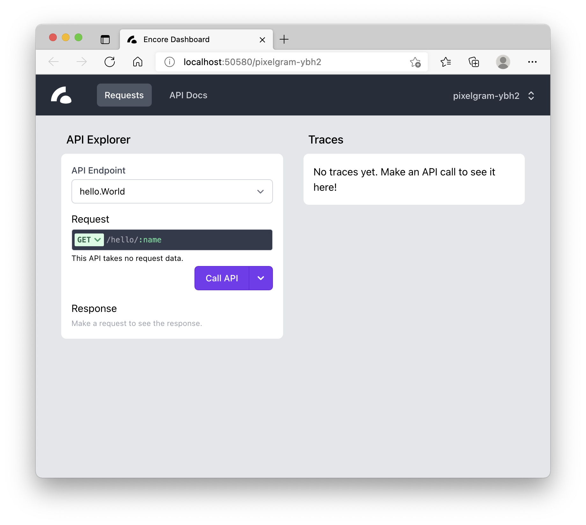
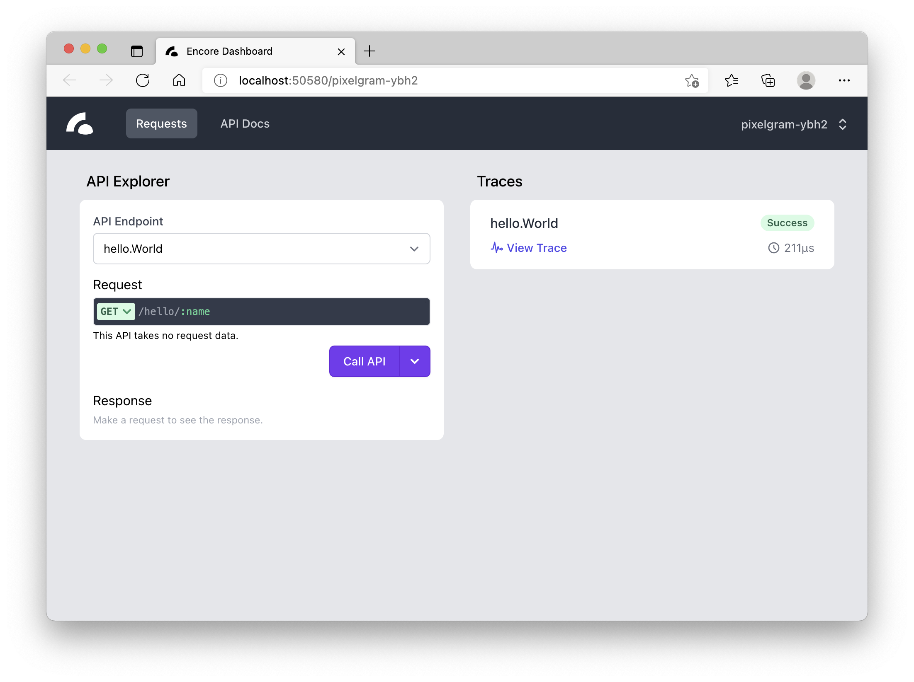
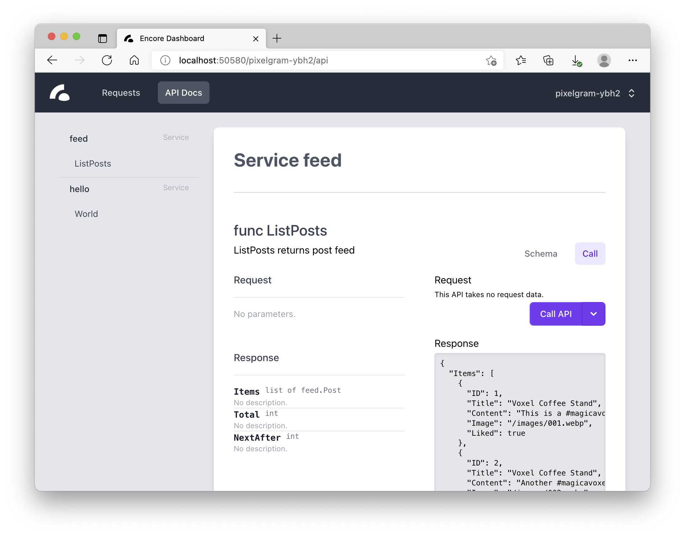
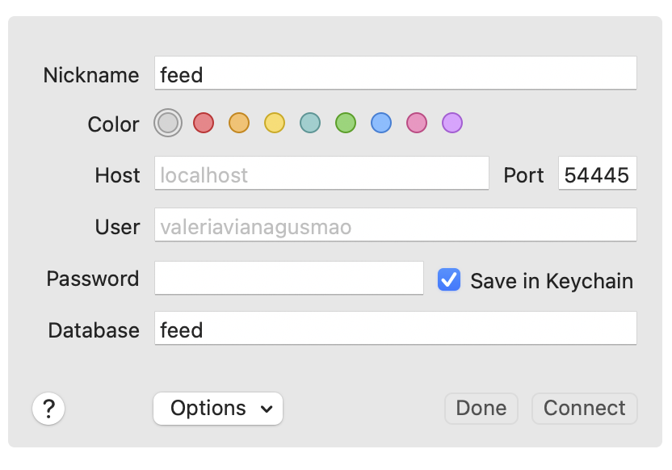
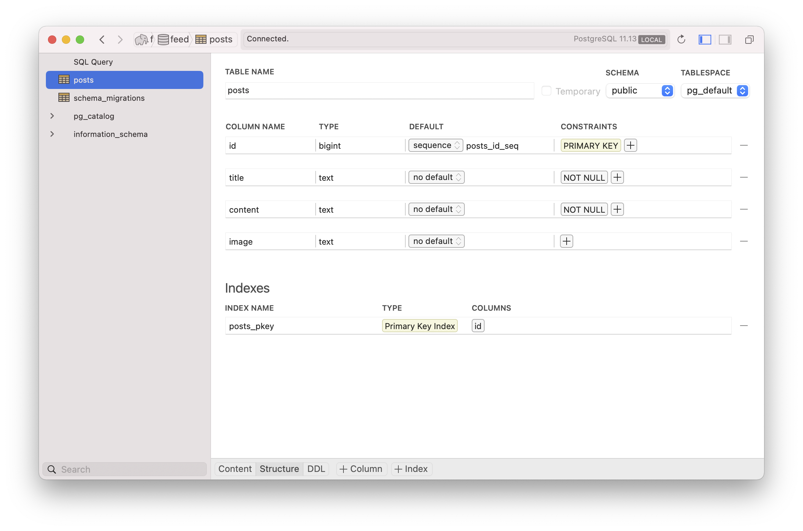

What I'm about to share is going to blow up your mind regardless of how many backends you've built. It is also the reason I am certain I can pull off a social network by myself. 

Meet [Encore](https://encore.dev).
<!--more-->
## Encore

The website does a better introduction to the engine than I ever could, so I'll just say that Encore allows you to write and deploy Go *microservices* to major cloud providers or their own Encore cloud. And yes, it is [open-source](https://github.com/encoredev/encore), has a free hobby hosting tier and I'm not an affiliate 😇

I could tell you how I found out about Encore or that it was the reason I started learning Go in the first place, but none of it really matters. So let's just build something already!

You should have Go installed and, apart from that, you'll need [Docker](https://www.docker.com/products/docker-desktop) and [Git](https://github.com/git-guides/install-git). Now go ahead and install *encore* command-line tool as described in [Encore Quick Start](https://encore.dev/docs/quick-start).

Then, create a new app with `encore app create`. I used the following settings, but feel free to name it whatever you want, of course:
```sh
encore app create  
? App Name (lowercase letters, digits, and dashes) pixelgram
? Select app template: Hello World (Encore introduction)
```

Then, run the app with:
```sh
encore run

  ✔ Building Encore application graph... Done!
  ✔ Analyzing service topology... Done!
  ✔ Generating boilerplate code... Done!
  ✔ Compiling application source code... Done!

  Encore development server running!

  Your API is running at:     http://localhost:4000
  Development Dashboard URL:  http://localhost:50580/pixelgram-ybh2

3:22PM INF registered endpoint func=hello.World path=/hello/:name
```

And enjoy your very own *development dashboard*:


Now make a request:
```sh
curl http://localhost:4000/hello/pixelgram
{
  "Message": "Hello, pixelgram!"
}
```

And check the dashboard again:


See your request *trace*? Isn't it just awesome?!

Take your time to explore the dashboard, code in the `hello` package and maybe even deploy the app to the cloud with `git push encore` 🤩

And yet it's just a fraction of what Encore can do!

## Feed

Now, back to building the social network. It makes sense to start with the `feed` service, after all that is literally the core functionality.

Create a `feed` folder in the encore app and add a `feed.go` file:
```go
package feed

import "context"

type Post struct {
	ID      int
	Title   string
	Content string
	Image   string
	Liked   bool
}

type PostList struct {
	Items     []*Post
	Total     int
	NextAfter int
}

// ListPosts returns post feed
//encore:api method=GET public path=/feed
func ListPosts(ctx context.Context) (*PostList, error) {
	list := PostList{
		Items: []*Post{
			{
				ID:      1,
				Image:   "/images/001.webp",
				Title:   "Voxel Coffee Stand",
				Content: "This is a #magicavoxel coffee stand I made for the game I want to make one day. Do you like it?",
				Liked:   true,
			},
			{
				ID:      2,
				Title:   "Voxel Coffee Stand",
				Image:   "/images/002.webp",
				Content: "Another #magicavoxel creation of mine. It's a scary broken tower that didn't turn out as scary as I imagined it, but it has some furniture inside and even candles! Though you probably can't see them ...",
			},
		},
		Total: 2,
	}
	return &list, nil
}
```

Save the file and done. No need to restart the server 😎:
```sh
curl http://localhost:4000/feed
{
  "Items": [
    {
      "ID": 1,
      "Title": "Voxel Coffee Stand",
      "Content": "This is a #magicavoxel coffee stand I made for the game I want to make one day. Do you like it?",
      "Image": "/images/001.webp",
      "Liked": true
    },
    {
      "ID": 2,
      "Title": "Voxel Coffee Stand",
      "Content": "Another #magicavoxel creation of mine. It's a scary broken tower that didn't turn out as scary as I imagined it, but it has some furniture inside and even candles! Though you probably can't see them ...",
      "Image": "/images/002.webp",
      "Liked": false
    }
  ],
  "Total": 2,
  "NextAfter": 0
}
```

Or you could use the dashboard instead of `curl` to call the API:


How cool is that?! And the only Encore-specific code was this comment:
```go
//encore:api method=GET public path=/feed
```

The `public` keyword means that this endpoint should be available for everyone, as opposed to `private` that can only be accessed within the same network and `auth` that requires a user to be authenticated via `Authorization` header.

But the endpoint doesn't do much yet. It'd be nicer if it could read posts from the database.

Encore provides first-class support for [PostgreSQL](https://www.postgresql.org/) as every major cloud provider offers this database as a service.

Create a `feed/migrations` folder and create the first migration `1_create_posts_table.up.sql`:
```sql
CREATE TABLE posts (
    id BIGSERIAL PRIMARY KEY,
    title TEXT NOT NULL,
    content TEXT NOT NULL,
    image TEXT
);
```

Save it and try this:
```sh
encore db shell feed
psql (13.4, server 11.13)
Type "help" for help.

feed=# select * from posts;
 id | title | content | image 
----+-------+---------+-------
(0 rows)

feed=# 
```

Alternatively, you could set a *proxy* connection to use a *GUI* database client:
```sh
encore db proxy feed
# dbproxy: listening for TCP connections on localhost:54445
```

I'm using [Postico](https://eggerapps.at/postico/), but the same approach will work for any other PostgreSQL client,  e.g. [VSCode PostgreSQL extension](https://marketplace.visualstudio.com/items?itemName=ckolkman.vscode-postgres)

- Use the provided host and port to connect to the database, e.g. **host**:`localhost`, **port**:`54445`
- Use the name of your service as a **database** name, e.g. `feed`
- Leave **username** and **password** fields *empty*


  
And voilà:


 
Now, how about we write some tests?

## Testing with Encore

Testing endpoints that are essentially just functions is already easy enough, but Encore also creates isolated test databases and handles all the boilerplate that comes with it as well.

Create a `feed/feed_test.go` with:
```go
package feed

import (
	"context"
	"testing"

	"encore.dev/storage/sqldb"
)

func TestPostsTable(t *testing.T) {
	ctx := context.Background()
	items := []*Post{
		{
			ID:      1,
			Image:   "/images/001.webp",
			Title:   "Voxel Coffee Stand",
			Content: "This is a #magicavoxel coffee stand I made for the game I want to make one day. Do you like it?",
		},
		{
			ID:      2,
			Title:   "Voxel Coffee Stand",
			Image:   "/images/002.webp",
			Content: "Another #magicavoxel creation of mine. It's a scary broken tower that didn't turn out as scary as I imagined it, but it has some furniture inside and even candles! Though you probably can't see them ...",
		},
	}
	for _, item := range items {
		_, err := sqldb.Exec(ctx, `INSERT INTO posts (image, title, content) VALUES($1,$2,$3)`, item.Image, item.Title, item.Content)
		if err != nil {
			t.Fatal(err)
		}
	}
	var total int
	err := sqldb.QueryRow(ctx, `SELECT COUNT(*) FROM posts`).Scan(&total)
	if err != nil {
		t.Fatal(err)
	}
	if total != len(items) {
		t.Errorf("expected %d, got %d", len(items), total)
	}

}
``` 

And run the tests with:
```sh
encore test ./feed
ok      encore.app/feed 0.030s
```

This command is a wrapper around `go test` and therefore accepts the same arguments and provides the same tools, including benchmarking, for example. 

But if you'll try to run `go test` directly you'll see this error:
```go
go test ./feed
--- FAIL: TestPostsTable (0.00s)
panic: encore apps must be run using the encore command [recovered]
        panic: encore apps must be run using the encore command
```

So you might be wondering: "What's the need for a separate command at all?!"

Short answer: because of how Encore works.

## Encore under the hood

It's easy to forget, but Go is not a scripting language, it just compiles very fast 🥸 

So, to allow hot-reloading for example, Encore starts a daemon process that watches for changes in your code and compiles it.

Also to turn functions into actual handlers, Encore writes a lot of boilerplate code for you. Yet this code is not persisted to the file system, as it would slow things down by a lot, and therefore `go test` or `go run` have no way of accessing it.

Besides, Encore app is not compiled to one app, but to *microservices* that can interact between themselves in a much more efficient manner than just HTTP calls ([gRPC](https://grpc.io/)). 

A dedicated CLI tool is simply there to let developers forget about all that complexity and concentrate on the actual code.

Even though I've spent the whole post talking about it, I don't think I've covered half of what Encore offers now, not to mention all the amazing features that are coming soon 😍

By the way, don't hesitate to join [Encore Slack](https://encore.dev/slack) if you have any questions or ideas, as this is one of the most welcoming communities I've ever seen.

## Bonus Challenge

For those of you wondering who's gonna finish that `feed` service for the social network: you will 😅

A bonus challenge for today is:
- Write a test that checks that `ListPosts` pagination works properly
- Make the `ListPosts` accept `Limit` and `After` parameters and return posts in descending order by ID

Till the next time! And good luck!