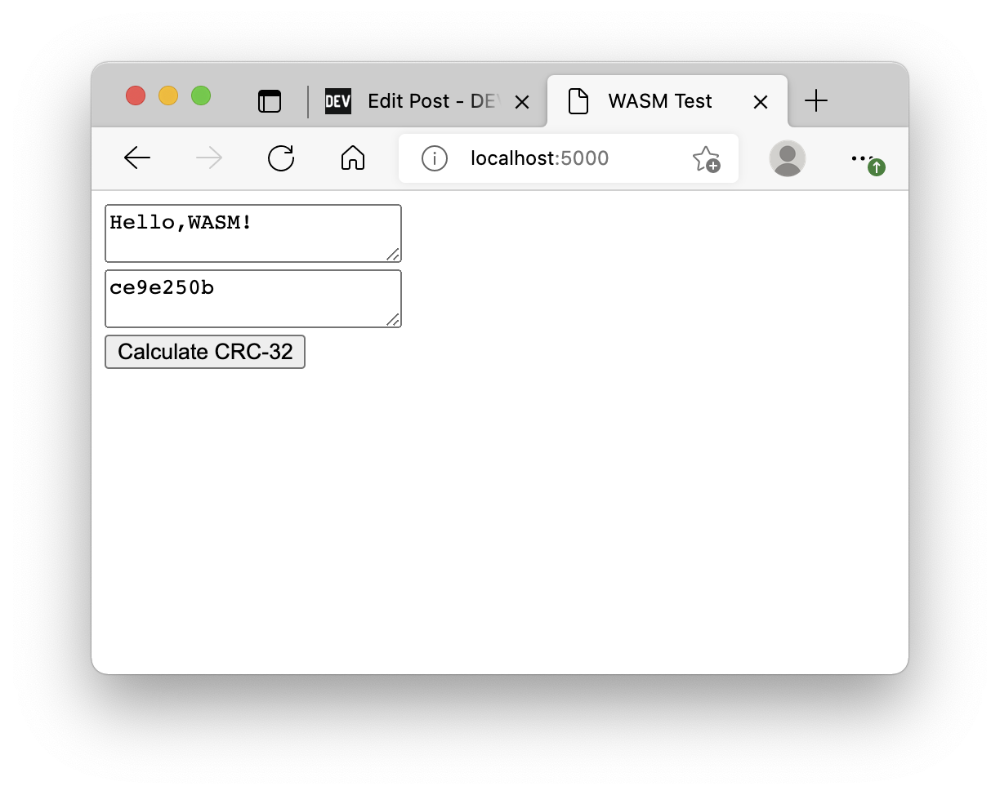
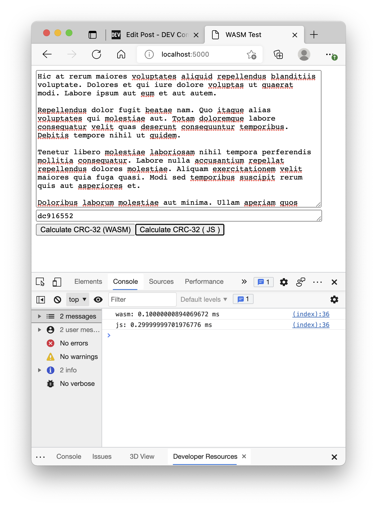
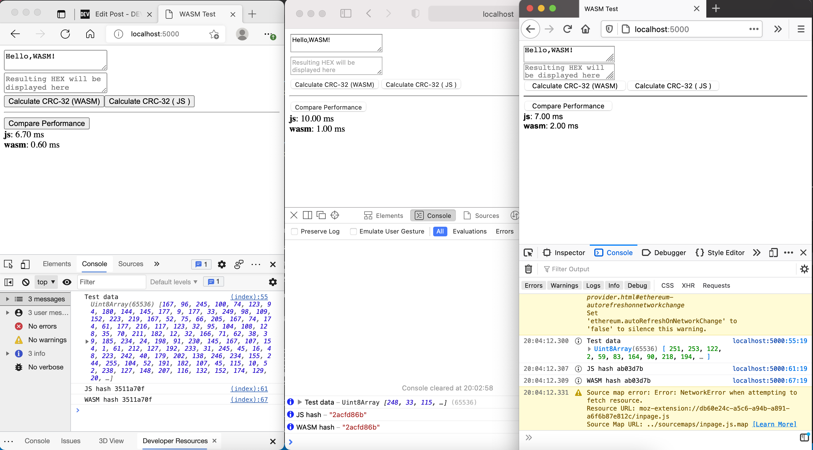

In this tutorial we'll build a [cyclic redundancy check (CRC)](https://en.wikipedia.org/wiki/Cyclic_redundancy_check) hashing function. More specifically, its 32 bit variant called "CRC-32". I bumped into it in the PNG specification, but it's also used in Gzip and bunch of other formats and protocols. In short, it makes a tiny (4 bytes) hash out of whatever binary data you feed to it and changes significantly if data changes even slightly. Of course, such a tiny function is not even close to be crypto secure, therefore it's only used to check if data was transferred correctly.

<!--more-->

I love JavaScript, but writing binary algorithm implementations in it is a torture thanks to signed integers conversion in bitwise operations. So, I've decided to write implementation in a strongly typed system language, my other favourite, `rust` and compile it to WebAssembly.

## What is WebAssembly

WebAssembly (a.k.a. WASM) provides a virtual machine that can be created from JavaScript environment (browser, nodejs or deno). This machine is super limited and runs only one binary program in a sandbox environment. It might sound boring, but, in fact, it can run almost anything: media manipulation software, AI, games - you name it.

## Installing rust and wasm tooling

If you are on a MacOS/Linux/other Unix machine installing rust is as simple as running this command in a terminal and following interactive instructions:

```sh
curl --proto '=https' --tlsv1.2 -sSf https://sh.rustup.rs | sh
```

To install on other OS refer to [rustup installation instructions](https://www.rust-lang.org/tools/install)

Once you're done this should work:

```sh
rustc --version
# rustc 1.53.0 (53cb7b09b 2021-06-17)
```

Next step is to install `wasm-pack`, a tool that compiles your WebAssembly module, generates JavaScript glue and TypeScript types for it.

If you're on a Unix machine the command is:

```sh
curl https://rustwasm.github.io/wasm-pack/installer/init.sh -sSf | sh
```

For other OS: refer to [wasm-pack installation instructions](https://rustwasm.github.io/wasm-pack/installer/).

Once again, make sure it's working:

```sh
wasm-pack --version
# wasm-pack 0.10.0
```

## Creating rust project

Rust comes with its own dependency manager `cargo`. It also helps with some routine operations, like project creation. Run this command to generate project folder and navigate into it:

```sh
cargo new --lib wasm-test && cd wasm-test
```

We should add crate type (_cdylib_) and the wasm binding dependency (_wasm-bindgen_) in the generated `Cargo.toml`:

```toml
[package]
name = "wasm-test"
version = "0.1.0"
edition = "2018"

# See more keys and their definitions at https://doc.rust-lang.org/cargo/reference/manifest.html

[lib]
crate-type = ["cdylib"]

[dependencies]
wasm-bindgen = "0.2"
```

Now let's add the CRC-32 algorithm implementation to `src/lib.rs`:

```rs
use wasm_bindgen::prelude::*;
// Pre-computed, see tests
const CRC_TABLE: [u32; 256] = [
    0, 1996959894, 3993919788, 2567524794, 124634137, 1886057615, 3915621685, 2657392035,
    249268274, 2044508324, 3772115230, 2547177864, 162941995, 2125561021, 3887607047, 2428444049,
    498536548, 1789927666, 4089016648, 2227061214, 450548861, 1843258603, 4107580753, 2211677639,
    325883990, 1684777152, 4251122042, 2321926636, 335633487, 1661365465, 4195302755, 2366115317,
    997073096, 1281953886, 3579855332, 2724688242, 1006888145, 1258607687, 3524101629, 2768942443,
    901097722, 1119000684, 3686517206, 2898065728, 853044451, 1172266101, 3705015759, 2882616665,
    651767980, 1373503546, 3369554304, 3218104598, 565507253, 1454621731, 3485111705, 3099436303,
    671266974, 1594198024, 3322730930, 2970347812, 795835527, 1483230225, 3244367275, 3060149565,
    1994146192, 31158534, 2563907772, 4023717930, 1907459465, 112637215, 2680153253, 3904427059,
    2013776290, 251722036, 2517215374, 3775830040, 2137656763, 141376813, 2439277719, 3865271297,
    1802195444, 476864866, 2238001368, 4066508878, 1812370925, 453092731, 2181625025, 4111451223,
    1706088902, 314042704, 2344532202, 4240017532, 1658658271, 366619977, 2362670323, 4224994405,
    1303535960, 984961486, 2747007092, 3569037538, 1256170817, 1037604311, 2765210733, 3554079995,
    1131014506, 879679996, 2909243462, 3663771856, 1141124467, 855842277, 2852801631, 3708648649,
    1342533948, 654459306, 3188396048, 3373015174, 1466479909, 544179635, 3110523913, 3462522015,
    1591671054, 702138776, 2966460450, 3352799412, 1504918807, 783551873, 3082640443, 3233442989,
    3988292384, 2596254646, 62317068, 1957810842, 3939845945, 2647816111, 81470997, 1943803523,
    3814918930, 2489596804, 225274430, 2053790376, 3826175755, 2466906013, 167816743, 2097651377,
    4027552580, 2265490386, 503444072, 1762050814, 4150417245, 2154129355, 426522225, 1852507879,
    4275313526, 2312317920, 282753626, 1742555852, 4189708143, 2394877945, 397917763, 1622183637,
    3604390888, 2714866558, 953729732, 1340076626, 3518719985, 2797360999, 1068828381, 1219638859,
    3624741850, 2936675148, 906185462, 1090812512, 3747672003, 2825379669, 829329135, 1181335161,
    3412177804, 3160834842, 628085408, 1382605366, 3423369109, 3138078467, 570562233, 1426400815,
    3317316542, 2998733608, 733239954, 1555261956, 3268935591, 3050360625, 752459403, 1541320221,
    2607071920, 3965973030, 1969922972, 40735498, 2617837225, 3943577151, 1913087877, 83908371,
    2512341634, 3803740692, 2075208622, 213261112, 2463272603, 3855990285, 2094854071, 198958881,
    2262029012, 4057260610, 1759359992, 534414190, 2176718541, 4139329115, 1873836001, 414664567,
    2282248934, 4279200368, 1711684554, 285281116, 2405801727, 4167216745, 1634467795, 376229701,
    2685067896, 3608007406, 1308918612, 956543938, 2808555105, 3495958263, 1231636301, 1047427035,
    2932959818, 3654703836, 1088359270, 936918000, 2847714899, 3736837829, 1202900863, 817233897,
    3183342108, 3401237130, 1404277552, 615818150, 3134207493, 3453421203, 1423857449, 601450431,
    3009837614, 3294710456, 1567103746, 711928724, 3020668471, 3272380065, 1510334235, 755167117,
];

/**
 * Reference implementation
 * http://libpng.org/pub/png/spec/iso/index-object.html#D-CRCAppendix
 */

#[wasm_bindgen]
pub fn crc(buf: Vec<u8>) -> u32 {
    let mut c: u32 = 0xffffffff;
    for v in buf {
        let idx: usize = (c as usize ^ v as usize) & 0xff;
        c = CRC_TABLE[idx] ^ (c >> 8);
    }
    c ^ 0xffffffff
}

#[cfg(test)]
mod tests {
    use super::*;

    #[test]
    fn test_table() {
        let mut crc_table: [u32; 256] = [0; 256];
        let mut c: usize;

        for n in 0..256 {
            c = n;
            for _ in 0..8 {
                c = if c & 1 == 1 {
                    0xedb88320 ^ (c >> 1)
                } else {
                    c >> 1
                }
            }
            crc_table[n] = c as u32;
        }

        assert_eq!(CRC_TABLE, crc_table);
    }

    #[test]
    fn test_iend() {
        assert_eq!(crc("IEND".as_bytes().to_vec()), 0xAE426082);
    }
}
```

The implementation uses pre-computed table for each byte value from 0x00 to 0xff and boils down to couple bitwise operations.

Macros `#[wasm_bindgen]` marks the function we want to export.

The unit tests in the end of the file can be run with:

```sh
cargo test

# running 2 tests
# test tests::test_iend ... ok
# test tests::test_table ... ok

# test result: ok. 2 passed; 0 failed; 0 ignored; 0 measured; 0 filtered out; finished in 0.00s
```

## Compiling WASM for Web Browser

Run this command:

```sh
wasm-pack build --target web --release
```

It creates a `pkg` folder with WASM module, TypeScript types, `package.json` and the main `wasm_test.js` file.

Let's create `index.html` file in the project root and import the generated script from there:

```html
<!DOCTYPE html>
<html lang="en">
  <head>
    <meta charset="UTF-8" />
    <meta http-equiv="X-UA-Compatible" content="IE=edge" />
    <meta name="viewport" content="width=device-width, initial-scale=1.0" />
    <title>WASM Test</title>
  </head>
  <body>
    <div>
      <textarea id="input" placeholder="Place your data here">
Hello,WASM!</textarea
      >
      <br />
      <textarea
        id="output"
        readonly
        placeholder="Resulting HEX will be displayed here"
      ></textarea>
      <br />
      <button disabled id="btn">Calculate CRC-32</button>
    </div>
    <script type="module">
      import init, { crc } from "./pkg/wasm_test.js";
      const btn = document.getElementById("btn");
      const input = document.getElementById("input");
      const output = document.getElementById("output");
      init().then(() => {
        btn.disabled = false;
        btn.onclick = () => {
          const buffer = new TextEncoder().encode(input.value);
          output.value = crc(buffer).toString(16);
        };
      });
    </script>
  </body>
</html>
```

For security reasons you won't be able to test this html file by simply opening it, but you can start a simple file server with:

```sh
npx serve .
# npx: installed 88 in 6.469s
#
#   ┌────────────────────────────────────────┐
#   │                                        │
#   │   Serving!                             │
#   │                                        │
#   │   Local:  http://localhost:5000        │
#   │                                        │
#   │   Copied local address to clipboard!   │
#   │                                        │
#   └────────────────────────────────────────┘
#
```

If you can't run this command, that probably means that either [NodeJS](https://nodejs.org/en/download/) or NPM is not installed.

Navigate your browser to `http://localhost:5000` and click the "Calculate CRC-32" button to see something like this:


## Comparing JS and WASM performance

Let's create nearly identical JavaScript implementation of CRC-32 in `crc.js`:

```js
const CRC_TABLE = new Uint32Array([
  0, 1996959894, 3993919788, 2567524794, 124634137, 1886057615, 3915621685,
  2657392035, 249268274, 2044508324, 3772115230, 2547177864, 162941995,
  2125561021, 3887607047, 2428444049, 498536548, 1789927666, 4089016648,
  2227061214, 450548861, 1843258603, 4107580753, 2211677639, 325883990,
  1684777152, 4251122042, 2321926636, 335633487, 1661365465, 4195302755,
  2366115317, 997073096, 1281953886, 3579855332, 2724688242, 1006888145,
  1258607687, 3524101629, 2768942443, 901097722, 1119000684, 3686517206,
  2898065728, 853044451, 1172266101, 3705015759, 2882616665, 651767980,
  1373503546, 3369554304, 3218104598, 565507253, 1454621731, 3485111705,
  3099436303, 671266974, 1594198024, 3322730930, 2970347812, 795835527,
  1483230225, 3244367275, 3060149565, 1994146192, 31158534, 2563907772,
  4023717930, 1907459465, 112637215, 2680153253, 3904427059, 2013776290,
  251722036, 2517215374, 3775830040, 2137656763, 141376813, 2439277719,
  3865271297, 1802195444, 476864866, 2238001368, 4066508878, 1812370925,
  453092731, 2181625025, 4111451223, 1706088902, 314042704, 2344532202,
  4240017532, 1658658271, 366619977, 2362670323, 4224994405, 1303535960,
  984961486, 2747007092, 3569037538, 1256170817, 1037604311, 2765210733,
  3554079995, 1131014506, 879679996, 2909243462, 3663771856, 1141124467,
  855842277, 2852801631, 3708648649, 1342533948, 654459306, 3188396048,
  3373015174, 1466479909, 544179635, 3110523913, 3462522015, 1591671054,
  702138776, 2966460450, 3352799412, 1504918807, 783551873, 3082640443,
  3233442989, 3988292384, 2596254646, 62317068, 1957810842, 3939845945,
  2647816111, 81470997, 1943803523, 3814918930, 2489596804, 225274430,
  2053790376, 3826175755, 2466906013, 167816743, 2097651377, 4027552580,
  2265490386, 503444072, 1762050814, 4150417245, 2154129355, 426522225,
  1852507879, 4275313526, 2312317920, 282753626, 1742555852, 4189708143,
  2394877945, 397917763, 1622183637, 3604390888, 2714866558, 953729732,
  1340076626, 3518719985, 2797360999, 1068828381, 1219638859, 3624741850,
  2936675148, 906185462, 1090812512, 3747672003, 2825379669, 829329135,
  1181335161, 3412177804, 3160834842, 628085408, 1382605366, 3423369109,
  3138078467, 570562233, 1426400815, 3317316542, 2998733608, 733239954,
  1555261956, 3268935591, 3050360625, 752459403, 1541320221, 2607071920,
  3965973030, 1969922972, 40735498, 2617837225, 3943577151, 1913087877,
  83908371, 2512341634, 3803740692, 2075208622, 213261112, 2463272603,
  3855990285, 2094854071, 198958881, 2262029012, 4057260610, 1759359992,
  534414190, 2176718541, 4139329115, 1873836001, 414664567, 2282248934,
  4279200368, 1711684554, 285281116, 2405801727, 4167216745, 1634467795,
  376229701, 2685067896, 3608007406, 1308918612, 956543938, 2808555105,
  3495958263, 1231636301, 1047427035, 2932959818, 3654703836, 1088359270,
  936918000, 2847714899, 3736837829, 1202900863, 817233897, 3183342108,
  3401237130, 1404277552, 615818150, 3134207493, 3453421203, 1423857449,
  601450431, 3009837614, 3294710456, 1567103746, 711928724, 3020668471,
  3272380065, 1510334235, 755167117,
]);

function update_crc(crc, buf) {
  let c = crc;

  for (const v of buf) {
    const idx = ((c ^ v) & 0xff) >>> 0;
    c = (CRC_TABLE[idx] ^ (c >>> 8)) >>> 0;
  }
  return c;
}
export default (buf) => (update_crc(0xffffffff, buf) ^ 0xffffffff) >>> 0;
```

The only thing that differs is the unsigned right shift (`>>>`) we added to get rid of signs in JS numbers.

We can now include this implementation along with some performance measurements in `index.html`:

```html
<!DOCTYPE html>
<html lang="en">
  <head>
    <meta charset="UTF-8" />
    <meta http-equiv="X-UA-Compatible" content="IE=edge" />
    <meta name="viewport" content="width=device-width, initial-scale=1.0" />
    <title>WASM Test</title>
  </head>
  <body>
    <div>
      <textarea id="input" placeholder="Place your data here">
Hello,WASM!</textarea
      >
      <br />
      <textarea
        id="output"
        readonly
        placeholder="Resulting HEX will be displayed here"
      ></textarea>
      <br />
      <button disabled id="btn-wasm">Calculate CRC-32 (WASM)</button
      ><button id="btn-js">Calculate CRC-32 ( JS )</button>
    </div>
    <script type="module">
      import init, { crc } from "./pkg/wasm_test.js";
      import crcjs from "./crc.js";

      const input = document.getElementById("input");
      const output = document.getElementById("output");

      const calculate = (fn, name) => {
        const buffer = new TextEncoder().encode(input.value);
        const t0 = performance.now();
        output.value = fn(buffer).toString(16);
        const t1 = performance.now();
        console.log(`${name}: ${t1 - t0} ms`);
      };

      document.getElementById("btn-js").onclick = () => calculate(crcjs, "js");

      init().then(() => {
        const btnWASM = document.getElementById("btn-wasm");
        btnWASM.disabled = false;
        btnWASM.onclick = () => calculate(crc, "wasm");
      });
    </script>
  </body>
</html>
```

Reload the page and check it out (open console to see performance information):


Not bad, WASM is nearly three times faster on 5 paragraphs of text, but both of them are still very fast. How about a bigger challenge?

Update `index.html` one last time:

```html
<!DOCTYPE html>
<html lang="en">
  <head>
    <meta charset="UTF-8" />
    <meta http-equiv="X-UA-Compatible" content="IE=edge" />
    <meta name="viewport" content="width=device-width, initial-scale=1.0" />
    <title>WASM Test</title>
  </head>
  <body>
    <div>
      <textarea id="input" placeholder="Place your data here">
Hello,WASM!</textarea
      >
      <br />
      <textarea
        id="output"
        readonly
        placeholder="Resulting HEX will be displayed here"
      ></textarea>
      <br />
      <button disabled id="btn-wasm">Calculate CRC-32 (WASM)</button
      ><button id="btn-js">Calculate CRC-32 ( JS )</button>
      <hr />
      <button id="btn-test" disabled>Compare Performance</button>
      <div id="result"></div>
    </div>
    <script type="module">
      import init, { crc } from "./pkg/wasm_test.js";
      import crcjs from "./crc.js";

      const input = document.getElementById("input");
      const output = document.getElementById("output");

      const calculate = (fn, name) => {
        const buffer = new TextEncoder().encode(input.value);
        const t0 = performance.now();
        output.value = fn(buffer).toString(16);
        const t1 = performance.now();
        console.log(`${name}: ${t1 - t0} ms`);
      };

      document.getElementById("btn-js").onclick = () => calculate(crcjs, "js");

      init().then(() => {
        const btnWASM = document.getElementById("btn-wasm");
        btnWASM.disabled = false;
        btnWASM.onclick = () => calculate(crc, "wasm");
        const btnTest = document.getElementById("btn-test");
        btnTest.disabled = false;
        const result = document.getElementById("result");
        btnTest.onclick = () => {
          // Max random buffer
          result.innerHTML = "";
          const data = window.crypto.getRandomValues(new Uint8Array(65536));
          console.info("Test data", data);

          const t10 = performance.now();
          const hash1 = crcjs(data).toString(16);
          const t11 = performance.now();
          result.innerHTML += `<b>js</b>: ${(t11 - t10).toFixed(2)} ms<br/>`;
          console.info("JS hash", hash1.toString(16));

          const t00 = performance.now();
          const hash2 = crc(data).toString(16);
          const t01 = performance.now();
          result.innerHTML += `<b>wasm</b>: ${(t01 - t00).toFixed(2)} ms<br/>`;
          console.info("WASM hash", hash2.toString(16));
        };
      });
    </script>
  </body>
</html>
```

I've added the third button that creates a big random binary array (65.5Kb), marks time, runs JS and WASM CRC-32 implementation over that buffer and shares the findings.

Here are the results I got in Edge, Safari and Firefox:


## Using WASM from NodeJS

Similarly to web target, we can build NodeJS-friendly package by running:

```sh
wasm-pack build --target nodejs --out-dir pkg-node --release
```

The contents of `pkg-node` are mostly the same as web `pkg`, except for `wasm_test.js`, that now reads WASM module from the file system.

Create `index.js` with:

```js
const { PerformanceObserver, performance } = require("perf_hooks");
const crypto = require("crypto");
const { crc } = require("./pkg-node/wasm_test.js");
const crcJS = require("./crc.cjs");

const perfObserver = new PerformanceObserver((items) => {
  items.getEntries().forEach((entry) => {
    console.log(entry.name, entry.duration, "ms");
  });
});

perfObserver.observe({ entryTypes: ["measure"], buffer: true });

const size = 10_000_000;

crypto.randomBytes(size, (err, data) => {
  if (err) throw err;
  console.log(`Generated random ${(size / 1_000_000).toFixed(0)}MB of data`);
  performance.mark("wasm-start");
  const crcwasm = crc(data);
  performance.mark("wasm-end");

  performance.mark("js-start");
  const crcjs = crcJS(data);
  performance.mark("js-end");

  console.assert(crcjs, crcwasm, "CRC values differ!");
  performance.measure("js  ", "js-start", "js-end");
  performance.measure("wasm", "wasm-start", "wasm-end");
});
```

The imported CommonJS script `crc.cjs` is identical to `crc.js` apart from the last line ( export default => module.exports):

```js
const CRC_TABLE = new Uint32Array([
  0, 1996959894, 3993919788, 2567524794, 124634137, 1886057615, 3915621685,
  2657392035, 249268274, 2044508324, 3772115230, 2547177864, 162941995,
  2125561021, 3887607047, 2428444049, 498536548, 1789927666, 4089016648,
  2227061214, 450548861, 1843258603, 4107580753, 2211677639, 325883990,
  1684777152, 4251122042, 2321926636, 335633487, 1661365465, 4195302755,
  2366115317, 997073096, 1281953886, 3579855332, 2724688242, 1006888145,
  1258607687, 3524101629, 2768942443, 901097722, 1119000684, 3686517206,
  2898065728, 853044451, 1172266101, 3705015759, 2882616665, 651767980,
  1373503546, 3369554304, 3218104598, 565507253, 1454621731, 3485111705,
  3099436303, 671266974, 1594198024, 3322730930, 2970347812, 795835527,
  1483230225, 3244367275, 3060149565, 1994146192, 31158534, 2563907772,
  4023717930, 1907459465, 112637215, 2680153253, 3904427059, 2013776290,
  251722036, 2517215374, 3775830040, 2137656763, 141376813, 2439277719,
  3865271297, 1802195444, 476864866, 2238001368, 4066508878, 1812370925,
  453092731, 2181625025, 4111451223, 1706088902, 314042704, 2344532202,
  4240017532, 1658658271, 366619977, 2362670323, 4224994405, 1303535960,
  984961486, 2747007092, 3569037538, 1256170817, 1037604311, 2765210733,
  3554079995, 1131014506, 879679996, 2909243462, 3663771856, 1141124467,
  855842277, 2852801631, 3708648649, 1342533948, 654459306, 3188396048,
  3373015174, 1466479909, 544179635, 3110523913, 3462522015, 1591671054,
  702138776, 2966460450, 3352799412, 1504918807, 783551873, 3082640443,
  3233442989, 3988292384, 2596254646, 62317068, 1957810842, 3939845945,
  2647816111, 81470997, 1943803523, 3814918930, 2489596804, 225274430,
  2053790376, 3826175755, 2466906013, 167816743, 2097651377, 4027552580,
  2265490386, 503444072, 1762050814, 4150417245, 2154129355, 426522225,
  1852507879, 4275313526, 2312317920, 282753626, 1742555852, 4189708143,
  2394877945, 397917763, 1622183637, 3604390888, 2714866558, 953729732,
  1340076626, 3518719985, 2797360999, 1068828381, 1219638859, 3624741850,
  2936675148, 906185462, 1090812512, 3747672003, 2825379669, 829329135,
  1181335161, 3412177804, 3160834842, 628085408, 1382605366, 3423369109,
  3138078467, 570562233, 1426400815, 3317316542, 2998733608, 733239954,
  1555261956, 3268935591, 3050360625, 752459403, 1541320221, 2607071920,
  3965973030, 1969922972, 40735498, 2617837225, 3943577151, 1913087877,
  83908371, 2512341634, 3803740692, 2075208622, 213261112, 2463272603,
  3855990285, 2094854071, 198958881, 2262029012, 4057260610, 1759359992,
  534414190, 2176718541, 4139329115, 1873836001, 414664567, 2282248934,
  4279200368, 1711684554, 285281116, 2405801727, 4167216745, 1634467795,
  376229701, 2685067896, 3608007406, 1308918612, 956543938, 2808555105,
  3495958263, 1231636301, 1047427035, 2932959818, 3654703836, 1088359270,
  936918000, 2847714899, 3736837829, 1202900863, 817233897, 3183342108,
  3401237130, 1404277552, 615818150, 3134207493, 3453421203, 1423857449,
  601450431, 3009837614, 3294710456, 1567103746, 711928724, 3020668471,
  3272380065, 1510334235, 755167117,
]);

function update_crc(crc, buf) {
  let c = crc;

  for (const v of buf) {
    const idx = ((c ^ v) & 0xff) >>> 0;
    c = (CRC_TABLE[idx] ^ (c >>> 8)) >>> 0;
  }
  return c;
}

module.exports = (buf) => (update_crc(0xffffffff, buf) ^ 0xffffffff) >>> 0;
```

Finally, run the script:

```sh
node index
# Generated random 10MB of data
# js   253.875679 ms
# wasm 39.126159 ms
```

The bigger the size of the data to hash, the bigger is the gap between JS and WASM speeds:

```sh
# Generated random 100MB of data
js   2461.758713 ms
wasm 389.698142 ms

# Generated random 1000MB of data
js   25945.486315 ms
wasm 3763.860294 ms
```
