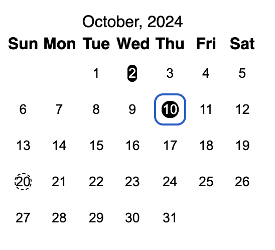
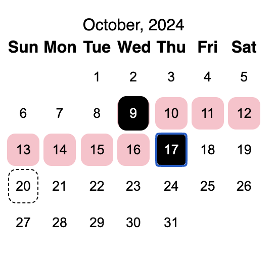
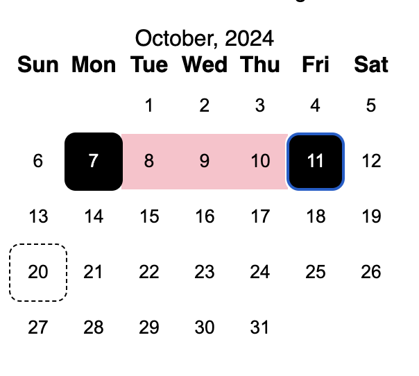

HTML comes with a lot of ready to use and flexible elements, but date selector
has a handful of limitations and the need to write your own calendar / date
input emerges sooner rather than later. In this tutorial I'll walk you through
implementing a calendar view and show how you can extend its functionality to fit
your booking widget or dashboard filter.

Here's how the final result might look like:

<!--render:custom-calendar-component/CalendarExample.ssi.tsx-->

## Building view

Building a calendar might sound challenging at first: you could wonder what
function to use to get days in a month or how would you handle date range
selection; and thus I suggest to start with something easier and less uncertain:
a static representation of one specific month.

For example something like this:

<p class="codepen" data-height="341.46875" data-default-tab="html,result" data-slug-hash="bGXRXXw" data-pen-title="Calendar View" data-user="valeriavg-the-flexboxer" style="height: 341.46875px; box-sizing: border-box; display: flex; align-items: center; justify-content: center; border: 2px solid; margin: 1em 0; padding: 1em;">
  <span>See the Pen <a href="https://codepen.io/valeriavg-the-flexboxer/pen/bGXRXXw">
  Calendar View</a> by Valeria (<a href="https://codepen.io/valeriavg-the-flexboxer">@valeriavg-the-flexboxer</a>)
  on <a href="https://codepen.io">CodePen</a>.</span>
</p>
<script async src="https://cpwebassets.codepen.io/assets/embed/ei.js"></script>

I used _semantic_ markup: table for the days table, `th` for the table headers
and `button` for the calendar days that can be selected. This should reduce
potential accessibility issues to a minimum since screen readers are pretty good
at reading standard html and browsers already have all required keyboard
navigation handlers assigned.

If you're, like me, residing in a country that counts weekdays from Monday, I
still suggest starting with a Sunday-first calendar and change the order later on to match how
JavaScript `Date` does that.

I encourage you to spend some time styling the calendar till it matches your vision before
we move on to implement a function that would be able to create such view for
any month of your choice.

### Generating calendar matrix

If we are to strip the markup from above to the bare bones we would end
up with the following data structure:

```json
[
  [null, null, 1, 2, 3, 4, 5],
  [6, 7, 8, 9, 10, 11, 12],
  [13, 14, 15, 16, 17, 18, 19],
  [20, 21, 22, 23, 24, 25, 26],
  [27, 28, 29, 30, 31, null, null]
]
```

We have a table with seven rows, a.k.a. matrix, where each row represents a `tr`
in a table and each cell represents a `td` within that row. Implementing JSX
component from such structure would be trivial:

```tsx
export default function CalendarView({
  month,
  year,
  days,
}: {
  month: string;
  year: number;
  days: Array<Array<number | null>>;
}) {
  return (
    <section>
      <header>
        {month}, {year}
      </header>
      <table>
        <thead>
          <tr>
            <th>Sun</th>
            <th>Mon</th>
            <th>Tue</th>
            <th>Wed</th>
            <th>Thu</th>
            <th>Fri</th>
            <th>Sat</th>
          </tr>
        </thead>
        <tbody>
          {days.map((row) => (
            <tr>
              {row.map((day) => (
                <td>{Boolean(day) && <button>{day}</button>}</td>
              ))}
            </tr>
          ))}
        </tbody>
      </table>
    </section>
  );
}
```

Now we "just" need to generate said matrix for every month of every year 😅.

> Note: I highly recommend creating a separate `Calendar` component that would
> hold the state and logic and would call `CalendarView` with the proper props
> to avoid over complicating the latter.

If you're up for a challenge, feel free to use these test cases to try and write
a function that would generate a proper matrix so that all the tests would pass
(including the commented out test checking all the calendars in the range of
1970 and 2100):

<iframe src="https://codesandbox.io/embed/wtcjft?view=editor+%2B+preview&module=%2Fsrc%2FcreateCalendar.test.ts"
     style="width:100%; height: 500px; border:0; border-radius: 4px; overflow:hidden;"
     title="calendar"
     allow="accelerometer; ambient-light-sensor; camera; encrypted-media; geolocation; gyroscope; hid; microphone; midi; payment; usb; vr; xr-spatial-tracking"
     sandbox="allow-forms allow-modals allow-popups allow-presentation allow-same-origin allow-scripts"
   ></iframe>

> Note: function `createCalendar`, similarly to `Date` itself, accepts integer
> month in a range from `0` to `11`, therefore March, for example, would be `4`
> and not `5` due to that.

<details>
	<summary>Here is a hint if you need one</summary>

```tsx
const lastDay = new Date(year, month + 1, 0);
```

</details>

And the whole solution if you prefer:

<details>
	<summary>createCalendar function</summary>

```tsx
export default function createCalendar({
  month,
  year,
}: {
  month: number;
  year: number;
}) {
  const days: Array<Array<number | null>> = [];
  const firstDay = new Date(year, month, 1);
  days.push(new Array(firstDay.getDay()).fill(null));
  const lastDay = new Date(year, month + 1, 0);
  for (let i = 1; i <= lastDay.getDate(); i++) {
    if (days[days.length - 1].length === 7) days.push([]);
    days[days.length - 1].push(i);
  }
  while (days[days.length - 1].length < 7) {
    days[days.length - 1].push(null);
  }
  return days;
}
```

</details>

## Day states

Now with an actual calendar let's try and highlight today's date and selected
date.

<details>
  <summary>How to check if a day is today</summary>

```tsx
const today = new Date();
const isToday = (day: number) =>
  today.getFullYear() === year &&
  today.getMonth() === month &&
  today.getDate() === day;
```

</details>

Then you just need to define a proper class for such case and assign it to the
day button:

```tsx
<button className={cx("day", isToday(day) && "today")}>{day}</button>;
```

Function `cx` I use comes from `@emotion/css` package I use, but you can write
it yourself:

```tsx
export const cx = (...classNames: Array<string | null | undefined | false>) =>
  classNames.filter(Boolean).join(" ");
```

Let's do the same for the selected dates. For now add e.g. `selectedDays`
property to the `CalendarView` and add a function to check is a certain day is
selected:

```tsx
// selectedDays?: Array<{day: number, month: number, year: number}>
const isSelected = (day: number) =>
  !!selectedDays?.find(
    (d) => d.year === year && d.month === month && d.day === day,
  );
```

And apply desired styles:

```tsx
<button
  className={cx("day", isToday(day) && "today", isSelected(day) && "selected")}
>
  {day}
</button>;
```

> Note: as you can see I'm avoiding using `Date` for storing calendar dates.
> This is intentional as I want to avoid issues due to time zones, since we're
> only interested in date and not specific time, but JavaScript is lacking a
> built in type for that.

## Handling data selection

Finally we've got to the most important part of functionality: actually being
able to select dates!

Let's start with defining the interface for our component. Similarly to design
driven development where we ensure that code reflects UX, it's easier to write a
function if we know what we want to pass as an input there.

I think I'd like to be able to pass any previously selected date into the
`Calendar` and have a callback function to notify when user has made it's
selection, something like that:

```tsx
export default function Calendar({
  onSelect,
  selectedDate,
}: {
  onSelect: (date: string) => void;
  selectedDate?: string;
}) {
  /* ... */
}
```

Depending on your needs, you should adjust the definition, for example if you'd
like to handle both selecting one date and interval you could write the
following code:

```tsx
export default function Calendar({
  onSelect,
  selectedDates,
}: {
  onSelect: (...dates: string[]) => void;
  selectedDates?: [string] | [string, string];
});
```

Or you could create a component for selecting two dates and a component for
selecting one date, since you can reuse `CalendarView` for either of the cases.

We've previously added `selectedDays` to `CalendarView`, so we only need to map
dates to `{day, month, year}` format:

```tsx
const date = new Date(selectedDate);
const selectedDays = [{
  year: date.getFullYear(),
  month: date.getMonth(),
  day: date.getDate(),
}];
```

Handling the selection itself is even easier. Let's add `onDayClick` prop in the
`CalendarView` for it:

```tsx
export default function CalendarView({
  month,
  year,
  days,
  onDayClick = () => { // <-- providing default "no operation" handler
    /*noop*/
    // <-- this comment there is to appease my linter that catches unintentional empty functions
  },
  selectedDays,
}: {
  month: number;
  year: number;
  days: Array<Array<number | null>>;
  onDayClick?: (day: Day) => void; // <--- optional, because we defined a default value
  selectedDays?: Day[];
});
```

And finally, add it to day `button.onClick`:

```tsx
<td>
  {!!day && (
    <button
      className={cx(
        styles.day,
        isToday(day) && styles.today,
        isSelected(day) && styles.selected,
      )}
      onClick={() => onDayClick({ day, month, year })}
    >
      <span>{day}</span>
    </button>
  )}
</td>;
```

You've probably heard about controlled and uncontrolled inputs in the context of
React components and we can make a similar architectural decision for our
`Calendar` component: would it have it's own state or would it be driven by
parent component?

Given that we already have `CalendarView` that is fully controlled by it's
props, I makes more sense to let `Calendar` handle logic and state.

For a single date selection we can utilize `useState` hook:

```tsx
const [selectedDay, setSelectedDay] = useState<
  { day: number; month: number; year: number }
>(defaultValue);
```

Then we pas `setSelectedDay` to `CalendarView.onDayClick` and done ✅

But when it comes to selecting two dates, the logic is much more complicated:

- User clicks on the first day
- User hovers over another day
- User clicks on the second day

Calendar in this case could only transition between certain "states", e.g. if
user hasn't selected the first day they yet can neither select the second one
nor highlight date they hover. This model is usually referred as a _finite-state
machine_ and React (as well as Preact and other renditions) have a hook called
`useReducer` for that case.

## Calendar reducer

Reducer is a simple function that accepts two parameters: previous state and
action object and returns next state:

```tsx
type CalendarState = {
  month: number;
  year: number;
  selectedDays?: [Day] | [Day, Day];
  hoverDay?: Day;
  isDirty: boolean;
};

type CalendarAction =
  | {
    type: "select_day";
    day: Day;
  }
  | {
    type: "hover_day";
    day: Day;
  };

const calendarReducer = (
  prevState: CalendarState,
  action: CalendarAction,
): CalendarState => {
  return prevState;
};
```

Unlike a hook, a reducer doesn't need to be defined within a component and can
be moved into it's own file and be unit tested just like any other function.

Here are some ideas how you could write tests for it:

```ts
describe("calendarReducer", () => {
  it.todo("should only allow to select first date when no dates are selected");
  it.todo("should only allow to hover on a day when first day is selected");
  it.todo("should only clear hover on day selection");
  it.todo("should only allow to select second date when first one is selected");
});
```

Here's how I'd handle date selection:

```tsx
const calendarReducer = (
  prevState: CalendarState,
  action: CalendarAction,
): CalendarState => {
  if (action.type === "select_day") {
    if (prevState.selectedDays?.length === 1) {
      return {
        ...prevState,
        hoverDay: undefined,
        selectedDays: [prevState.selectedDays[0], action.day].sort(
          (a, b) =>
            new Date(a.year, a.month, a.day).getTime() -
            new Date(b.year, b.month, b.day).getTime(),
        ) as [Day, Day],
        isDirty: true,
      };
    }

    return {
      ...prevState,
      hoverDay: undefined,
      selectedDays: [action.day] as [Day],
      isDirty: true,
    };
  }
  return prevState;
};
```

> Note: Do not modify `prevState`. You should either pass it as is to indicate
> that no changes were made or create a new object to trigger re-render of your
> component.

With that in place we can add the following to the `Calendar` component:

```tsx
const [state, dispatch] = useReducer(
  calendarReducer,
  createDefaultState(selectedDates),
);

const days = createCalendar({ month: state.month, year: state.year });

const onDayClick = (day: Day) => {
  dispatch({ type: "select_day", day });
};
```

That should handle the selection of multiple dates as well as lay out the
foundation for switching between the months and years. The only missing part is
calling `onSelect` when the selection is made.

We can't really incorporate it into a reducer, since it's outside of `Calendar`,
but `useEffect` hook would come in handy.

<details>
<summary>Here's how mine looks like</summary>

```tsx
useEffect(() => {
  if (state.isDirty && state.selectedDays?.length === 2) {
    if (
      state.selectedDays[0].day === state.selectedDays[1].day &&
      state.selectedDays[0].month === state.selectedDays[1].month &&
      state.selectedDays[0].year === state.selectedDays[1].year
    ) {
      return onSelect(
        new Date(
          state.selectedDays[0].year,
          state.selectedDays[0].month,
          state.selectedDays[0].day,
          12,
        )
          .toISOString()
          .split("T")
          .shift()!,
      );
    }
    onSelect(
      ...(state.selectedDays.map(
        (d) =>
          new Date(d.year, d.month, d.day, 12)
            .toISOString()
            .split("T")
            .shift()!,
      ) as [string, string]),
    );
  }
}, [state.isDirty, state.selectedDays]);
```

</details>

And that's pretty much a fully functional calendar that works with keyboard
navigation (try `Tab`,`Shift + Tab` and `Enter`), mobile touches and mouse out
of the box!

Let's add some finishing touches to user experience.

## Displaying hovered state and date intervals

Take a look at this example from
[Material Design library](https://m2.material.io/components/date-pickers/android#date-range-pickers):


Every day in the selected interval is highlighted and "connects" selected dates
with an uninterrupted line.

To achieve this effect we need to go back to `CalendarView` and add a `span`
element to the day button and move the selection state there:

```tsx
<td>
  {!!day && (
    <button
      className={cx(
        "day",
      )}
      onClick={() => onDayClick({ day, month, year })}
    >
      <span
        className={cx(
          "day",
          isToday(day) && "today",
          isSelected(day) && "selected",
        )}
      >
        {day}
      </span>
    </button>
  )}
</td>;
```

This way we can use `button` container to add a background when day is covered,
alter edge days borders and have the selected and today date highlighted same as
before.

You'll probably need to adjust the "day" style and make sure that `span` takes
all the space in the button to fix this:



It can be done by setting `display` to `flex` (as span is `inline` by default)
and setting `align-items` and `justify-content` value to `center`

Let's define a style for the "hovered" day or a date in the selected interval,
for example:

```css
.hovered {
  background-color: pink;
  border-radius: 0;
}
```

And a function to determine if the day is within the interval:

```ts
const isBetweenSelected = (day: number) => {
  if (selectedDays?.length !== 2) return false;
  const interval = selectedDays.map((d) => new Date(d.year, d.month, d.day));
  const date = new Date(year, month, day);
  return (
    interval[0].getTime() < date.getTime() &&
    interval[1].getTime() > date.getTime()
  );
};
```

> Note: this is possible because we're sorting state on every date selection
> therefore we can trust that days are always ordered in ascending order (older
> first).

But when applied to `button` class name the effect is not exactly as he hoped
for: 

To change that let's remove the gap between table cells:

```css
table {
  border-spacing: 0;
  border-collapse: collapse;
}
```

Add add these properties to the table:

```tsx
<table cellpadding={0} cellspacing={0}>
```

Additionally, you might need to increase the size of cells or reduce the text
size in the table header as "Wed" was pushing all the cells in the column to be
a bit wider than all others:

```css
.day {
  width: 2.5rem;
  height: 2.5rem;
  min-width: 2.5rem; /* makes flex to be less flexible */
  min-height: 2.5rem; /* and keep the size intact */
}
```



You could notice that there's a bit of a gap between selected date and the
interval, to fix that we could add same background to the selected days and
apply borders for the left and right side, e.g.:

```css
.is-first-selected {
  border-top-left-radius: 0.5rem;
  border-bottom-left-radius: 0.5rem;
}
.is-last-selected {
  border-top-right-radius: 0.5rem;
  border-bottom-right-radius: 0.5rem;
}
```

And apply it to the `button`:

```tsx
<button
  className={cx(
    "day",
    isBetweenSelected(day) && "hovered",
    isFirstSelected(day) && "isFirstSelected",
    isLastSelected(day) && "isLastSelected",
  )}
  onClick={() => onDayClick({ day, month, year })}
>
  <span
    className={cx(
      "day",
      isToday(day) && "today",
      isSelected(day) && "selected",
    )}
  >
    {day}
  </span>
</button>;
```

> Note: You might also want to change `isBetweenSelected` to include first &
> last date or add same background to the last & first selected classes.

<details>
<summary> <em>isBetweenSelected</em>, <em>isFirstSelected</em> and <em>isLastSelected</em> functions </summary>

```tsx
const isBetweenSelected = (day: number) => {
  if (selectedDays?.length !== 2) return false;
  const interval = selectedDays.map((d) => new Date(d.year, d.month, d.day));
  const date = new Date(year, month, day);
  return (
    interval[0].getTime() <= date.getTime() &&
    interval[1].getTime() >= date.getTime()
  );
};

const isFirstSelected = (day: number) => {
  if (!selectedDays?.length) return false;
  const d = selectedDays[0];
  return d.year === year && d.month === month && d.day === day;
};
const isLastSelected = (day: number) => {
  if (selectedDays?.length !== 2) return false;
  const d = selectedDays[1];
  return d.year === year && d.month === month && d.day === day;
};
```

</details>

Implementing hover functionality should be quite straightforward by using the
same approach we used with `selectedDays` and I'll leave it to you to figure
out, but if you are interested in the exact code that fuels
[example](#calendar), feel free to check it on
[GitHub](https://github.com/ValeriaVG/valeriavg.dev/tree/main/content/custom-calendar-component).

> Challenge: Remember how I said you could come back and implement a calendar that starts from Monday later on? Now is the time to try and tackle this challenge! Good luck!
