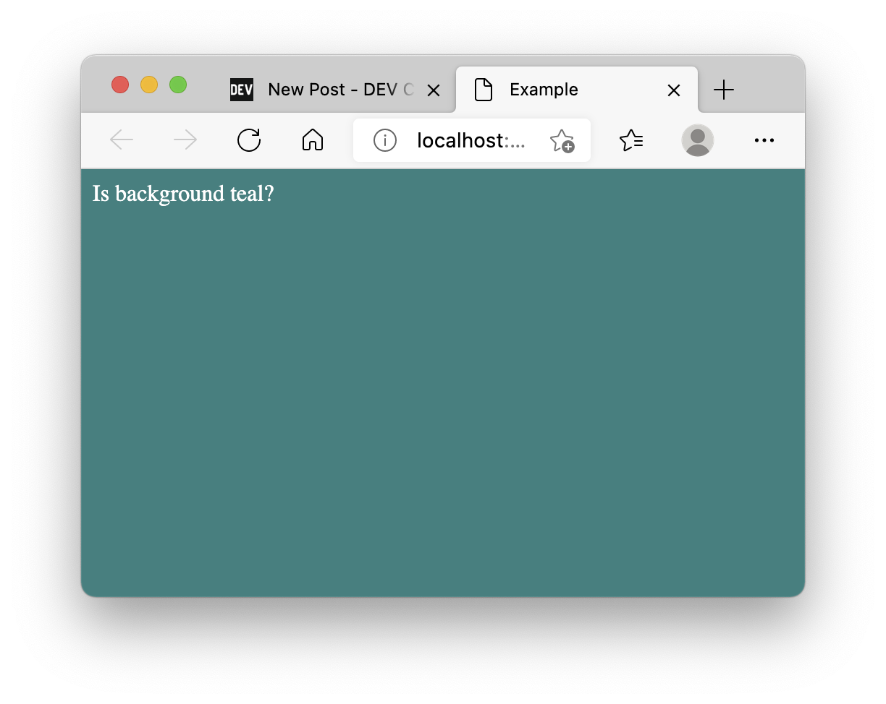

There are quite a few cases where you can benefit from importing an arbitrary file directly: in universal apps, tests, or simply to avoid boilerplate. Good news: you don't need Babel, Webpack, or anything else for it.

For this tutorial, we'll make a server that will render a static HTML page with CSS styles, loaded as modules.

Create a CSS file:

```bash
echo 'html{background:teal;color:white;}' >> styles.css
```

An HTML template:

```bash
echo '<!DOCTYPE html>
<html lang="en">
  <head>
    <meta charset="UTF-8" />
    <meta http-equiv="X-UA-Compatible" content="IE=edge" />
    <meta name="viewport" content="width=device-width, initial-scale=1.0" />
    <title>Example</title>
  </head>
  <body>
    Is background teal?
  </body>
</html>' >> template.html
```

And a server to render the result:

```js
// index.js
const http = require("http");
const template = require("./template.html");
const css = require("./styles.css");
const html = template.replace("</head>", "<style>" + css + "</style></head>");

const server = new http.Server((_req, res) => {
  res.setHeader("content-type", "text/html");
  res.end(html);
});

server.listen(0, () => {
  console.info(
    `Server is listening on http://localhost:${server.address().port}`
  );
});
```

If you try running this file now you'll get an error:

```bash
node index
template.html:1
<!DOCTYPE html>
^

SyntaxError: Unexpected token '<'
```

To fix it we are going to tell NodeJS how to handle these extensions. Prepare to be amazed because all the code we need is:

```js
// hook.js
const Module = require("module");
const fs = require("fs");

const resolveTextFile = function (module, path) {
  const content = fs.readFileSync(path).toString();
  module.exports = content;
};

Module._extensions[".html"] = resolveTextFile;
Module._extensions[".css"] = resolveTextFile;
```

Now we can start the server like this:

```bash
node -r ./hook index
# Server is listening on http://localhost:<random_port>
```

Follow the link and you should see the HTML page with proper styles:



> Note: If you have any troubles running this example, try using NodeJS v14.5.0.

By the way, you can add `require('./hook')` directly at the beginning of `index.js` instead of using `-r` or `--require` command-line argument.

## What about ECMAScript Modules?

Great question! ECMAScript modules support in NodeJS is still unstable, meaning that it might drastically change in the future, but as for February 2021 we can load custom modules with `node --experimental-loader <filename>`.

My ECMAScript server module looks like this:

```js
// index.mjs
import http from "http";
import template from "./template.html";
import css from "./styles.css";

const html = template.replace("</head>", "<style>" + css + "</style></head>");

const server = new http.Server((_req, res) => {
  res.setHeader("content-type", "text/html");
  res.end(html);
});

server.listen(0, () => {
  console.info(
    `Server module is listening on http://localhost:${server.address().port}`
  );
});
```

And the [experimental loader](https://nodejs.org/api/esm.html#esm_loaders) is as follows:

```js
// loader.mjs
import { URL, pathToFileURL } from "url";

const baseURL = pathToFileURL(`${process.cwd()}/`).href;

// css styles or html files
const extensionsRegex = /\.(html|css)$/;

export function resolve(specifier, context, defaultResolve) {
  const { parentURL = baseURL } = context;

  // Node.js normally errors on unknown file extensions, so return a URL for
  // specifiers ending in the specified file extensions.
  if (extensionsRegex.test(specifier)) {
    return {
      url: new URL(specifier, parentURL).href,
    };
  }
  // Let Node.js handle all other specifiers.
  return defaultResolve(specifier, context, defaultResolve);
}

export function getFormat(url, context, defaultGetFormat) {
  // Now that we patched resolve to let new file types through, we need to
  // tell Node.js what format such URLs should be interpreted as.
  if (extensionsRegex.test(url)) {
    return {
      format: "module",
    };
  }
  // Let Node.js handle all other URLs.
  return defaultGetFormat(url, context, defaultGetFormat);
}

export function transformSource(source, context, defaultTransformSource) {
  const { url } = context;
  if (extensionsRegex.test(url)) {
    return {
      source: `export default ${JSON.stringify(source.toString())}`,
    };
  }

  // Let Node.js handle all other sources.
  return defaultTransformSource(source, context, defaultTransformSource);
}
```

Don't forget to use `.mjs` extension for ES modules or otherwise enable them (e.g. set `"type":"module"` in `package.json`).

And run it with:

```bash
node --experimental-loader ./loader.mjs index.mjs
# (node:14706) ExperimentalWarning: --experimental-loader is an experimental feature. This feature could change at any time
# (Use `node --trace-warnings ...` to show where the warning was created)
# ESM Server is listening on http://localhost:<random_port>
```

## What about TypeScript?

Yet another great question! It's actually easy: we can use CommonJS approach.

Let's prepare TypeScript project:

```bash
npm init -y &&
npm install typescript @types/node ts-node --save-dev &&
echo '{
  "compilerOptions": {
    "target": "ES2020",
    "module": "CommonJS",
    "moduleResolution": "node",
    "esModuleInterop": true,
    "typeRoots": ["node_modules/@types", "typings"]
  },
  "exclude": ["node_modules"]
}
'>>tsconfig.json

```

I've set _esModuleInterop_ to true to keep `hook.js` intact, otherwise, we'd need to change `module.exports=content` to `module.exports.default=content`.

My typed version of the infamous server:

```ts
// index.ts
import { Server } from "http";
import template from "./template.html";
import css from "./styles.css";
import { AddressInfo } from "net";

const html = template.replace("</head>", "<style>" + css + "</style></head>");

const server = new Server((_req, res) => {
  res.setHeader("content-type", "text/html");
  res.end(html);
});

server.listen(0, () => {
  console.info(
    `TS Server is listening on http://localhost:${
      (server.address() as AddressInfo).port
    }`
  );
});
```

Once again, if we try running it now, it'll fail:

```bash
./node_modules/.bin/ts-node -r ./hook index.ts

# TSError: ⨯ Unable to compile TypeScript:
# index.ts:2:22 - error TS2307: Cannot find module './template.html' or its corresponding type declarations.
```

To fix it we, of course, need to provide typings for our modules. Since we'll be using `ts-node` the easiest way is to create a folder with the following structure:

```bash
mkdir -p "typings/*.css" &&
mkdir "typings/*.html" &&
echo 'declare module "*.css" {
  const content: string;
  export default content;
}' >> "typings/*.css/index.d.ts" &&
echo 'declare module "*.html" {
  const content: string;
  export default content;
}' >> "typings/*.html/index.d.ts"
```

We've already included _typings_ folder in `tsconfig.json`, but you can call it anything you want as long as it's referenced:

```json
{
  "compilerOptions": {
    // ...
    "typeRoots": ["node_modules/@types", "typings"]
  }
  // ...
}
```

Run again and enjoy refreshing teal background:

```bash
./node_modules/.bin/ts-node -r ./hook index.ts
# TS Server is listening on http://localhost:<random_port>
```

## Nice, what's next?

You could:

- Add pre- or post-processing step for the styles (e.g. use `sass`,`less` or `postcss`) or some template engine for HTML (e.g. `liquid`, `haml` or `pug`.
- Make a GraphQL server using `.graphql` files directly.
- Write unit tests for your front-end JavaScript with lightweight or custom test runners.
- Make your own code transpiler/bundler
